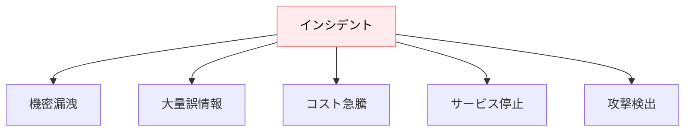
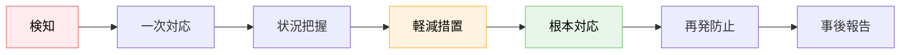
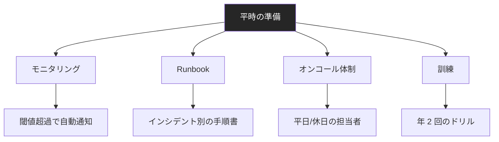

---
tags:
  - incident
  - ops
  - security
  - runbook
---

# LLM アプリのインシデント対応

Tech Notes
#incident
#ops
#security
#runbook
updated 2026-04-13
6 min read

LLM アプリで**インシデントが発生したとき**の初動対応を、事前に決めておく。インシデントの種類ごとに異なる対応手順を持つのが鉄則。

### インシデントの分類

### 共通の初動フロー

**1. 検知**: アラート or ユーザー報告
**2. 一次対応（5 分以内）**: インシデント担当者が状況を共有し、緊急対応を決める
**3. 状況把握**: 影響範囲・影響人数・発生時刻を特定
**4. 軽減措置**: 被害拡大を止める（機能停止、キー無効化等）
**5. 根本対応**: 原因を修正
**6. 再発防止**: 監視・仕組み追加
**7. 事後報告**: 関係者・ユーザーへ説明

### インシデント別の対応

**1. 機密漏洩**

API キー漏洩、個人情報露出、システムプロンプト流出など。

- 即座に関連する API キーを無効化
- 影響範囲を特定（誰のデータ？どれだけ？）
- 法的要件（GDPR 等）に従って報告
- ログ精査で被害範囲確定

**2. 大量誤情報**

ハルシネーションで大量のユーザーに誤情報を配信。

- 該当機能を一時停止
- 影響を受けたユーザーを特定
- 訂正情報を配信
- プロンプト・評価セットの改修

**3. コスト急騰**

無限ループ・攻撃・設定ミスでコストが想定の 10 倍。

- API プロバイダーで使用上限設定
- 該当機能を停止
- ログで原因特定
- 原因修正後、段階的に再開

**4. サービス停止**

LLM API が落ちた、レート制限にかかった等。

- 縮退運転に切り替え（決定論的ロジック or キャッシュ応答）
- ユーザーにメンテナンス通知
- プロバイダーのステータス確認
- 復旧したら段階的に戻す

**5. 攻撃検出**

プロンプトインジェクション・大量の異常入力を検知。

- IP ブロック・レート制限強化
- 攻撃パターンを記録
- プロンプト・入力フィルタを強化
- レッドチーミングで再発防止を確認

### 事前準備（これが本番）

**1. モニタリング**: 閾値超過で自動通知（[運用メトリクス](ai-エージェント運用の-10-メトリクス.md)参照）

**2. Runbook**: インシデント種別ごとの対応手順書。**慌てずに動けるように**。

**3. オンコール**: 24/7 対応でなくても、業務時間外の連絡経路は整備する

**4. 訓練**: 定期的にドリル（シミュレーション訓練）を実施

### 事後報告テンプレート

    # インシデント報告書

    ## 概要
    - 発生日時: <タイムスタンプ>
    - 解決日時: <タイムスタンプ>
    - 影響: <何人に、何が>

    ## タイムライン
    - HH:MM 検知
    - HH:MM 一次対応
    - HH:MM 軽減措置実行
    - HH:MM 根本原因特定
    - HH:MM 復旧

    ## 根本原因
    <技術的・プロセス的な原因>

    ## 再発防止策
    - <具体的対策 1>
    - <具体的対策 2>

    ## 学び
    <組織として学んだこと>

Blameless（個人責任追及なし）で書く。**プロセスの問題**として扱う。

### 報告の公開

オープンな組織（特に BtoB）は、**インシデント報告を外部公開**する傾向が強い。

- 透明性で信頼を得る
- ユーザーが自分で判断できる情報を渡す
- 業界全体の学びになる

### アンチパターン

**1. 準備なしで本番運用**

Runbook もオンコール体制もないまま運用し、発生時に大混乱。

**2. 報告を隠す**

ユーザーが後から他ルートで発覚して信頼失墜。**早く正確に**報告する。

**3. 再発防止を「がんばる」で済ます**

具体的な仕組み変更を伴わない再発防止は、再発する。

**4. 個人責任に帰す**

「〇〇さんが悪い」で終わると、組織的な学びがない。**プロセス・仕組みの問題**として扱う。

### チェックリスト

- [ ] インシデントの分類を事前に定義している
- [ ] 各分類ごとの Runbook がある
- [ ] オンコール担当者が決まっている
- [ ] 検知アラートが稼働している
- [ ] 定期的にドリルしている
- [ ] Blameless な事後報告の文化がある

### まとめ

LLM アプリのインシデント対応は、**発生してから考える**のでは遅い。**分類・Runbook・訓練**の 3 点を平時に整えておく。これが運用品質を決める。

## 関連エントリ

- [AI エージェント運用の 10 メトリクス](ai-エージェント運用の-10-メトリクス.md)
- [LLM API キーの管理と漏洩防止](llm-api-キーの管理と漏洩防止.md)
- [LLM レッドチーミング — 意図的な攻撃で安全性を検証する](../techniques/llm-レッドチーミング-意図的な攻撃で安全性を検証する.md)

  
← [AI エージェント運用の 10 メトリクス](ai-エージェント運用の-10-メトリクス.md)

  
[OpenAI と Anthropic API の主要差分](openai-と-anthropic-api-の主要差分.md) →

