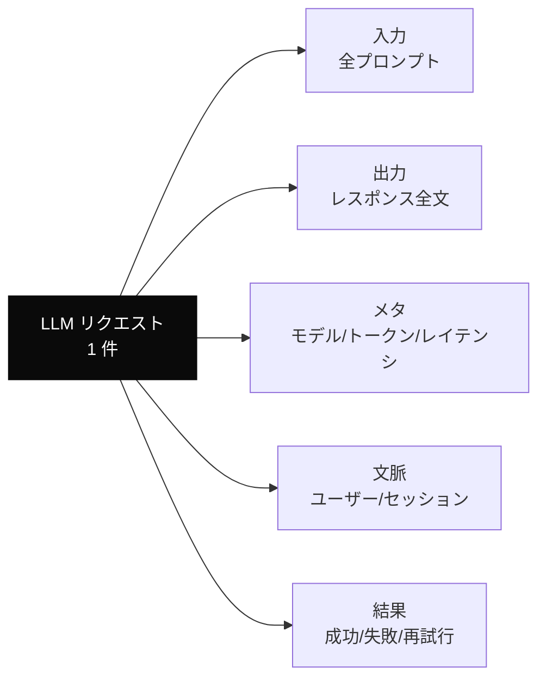
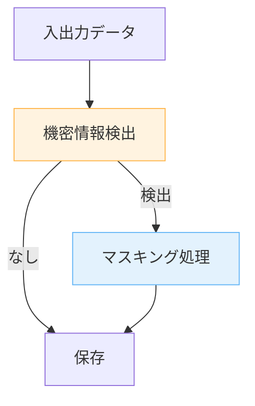

---
tags:
  - observability
  - logging
  - llm
---

# LLM アプリのログ設計で残すべき 5 項目

Tech Notes
#observability
#logging
#llm
updated 2026-04-13
3 min read

LLM を組み込んだアプリは、従来のアプリよりログ設計が重要。**非決定的な応答・高コスト・予測不能な失敗**を相手にするため、何が起きたかを後から再現できないと改善が進まない。

### 記録すべき 5 項目

**1. 入力プロンプト（全文）**

システムプロンプト・few-shot・ユーザー入力・ツール定義を **全て** 残す。部分的に残すと、後から再現できない。

**2. 出力レスポンス（全文）**

エラーで途中終了したケースも含む。ストリーミングなら最終的な累積結果を。

**3. メタ情報**

- モデル名・バージョン
- 入力トークン数・出力トークン数
- レイテンシ（TTFB・全体）
- 使用したツール名と引数

**4. 文脈情報**

- ユーザー ID（匿名化）
- セッション ID
- リクエスト ID（トレース用）
- タイムスタンプ

**5. 結果の分類**

- 成功・失敗・部分成功
- リトライ回数
- フォールバック発動有無

### プライバシーとの両立

LLM の入出力は個人情報を含む可能性が高い。**保存前に必ず検査**する。

- 個人情報（氏名、住所、電話番号、メール）は検出してマスキング
- 決済情報（カード番号等）は絶対にログに残さない
- 保存期間を明示し、期限超えで自動削除

### 分析に使える形で残す

単に JSON で保存するだけでは分析できない。**後で問いかけられるように**構造化する。

**観点の例**:

- モデル別のレイテンシ分布は?
- どのプロンプトで失敗が多いか?
- トークン使用量の推移は?
- ユーザーの再試行率は?

BigQuery や ClickHouse 等の列指向 DB にストリーミング投入し、SQL で集計できる形にしておくと運用が楽。

### アラート設計

異常検知は**静的閾値** + **相対変化**の両方を組み合わせる。

| 指標 | 閾値の例 |
|------|---------|
| エラー率 | 5% 超え |
| P95 レイテンシ | 通常の 3 倍以上 |
| コスト/時間 | 予算の 150% |
| 特定エラーコード | 1 時間で 10 件以上 |

### ツール選定

- **LLM 特化の観測ツール**: Langfuse / Helicone / LangSmith 等
- **汎用 APM**: Datadog / New Relic（LLM 用のメトリクス連携が増えている）
- **自前構築**: BigQuery + Looker など

規模が小さいうちは自前構築でも足りる。データ量が増えてきたら専用ツールに移行する。

### まとめ

LLM アプリの品質改善は**ログの質**に直結する。本番投入の **前** に、記録・マスキング・分析の 3 層を設計しておく。後付けでは手遅れになる。

## 関連エントリ

- [LLM API のレート制限との付き合い方](llm-api-のレート制限との付き合い方.md)
- [Eval-Driven Development — LLM 機能開発は評価から始める](../concepts/eval-driven-development-llm-機能開発は評価から始める.md)
- [LLM から構造化 JSON を確実に取り出す](../techniques/llm-から構造化-json-を確実に取り出す.md)

  
← [LLM API のレート制限との付き合い方](llm-api-のレート制限との付き合い方.md)

  
[ナレッジベースのファイル命名規則とテキスト規約](ナレッジベースのファイル命名規則とテキスト規約.md) →

