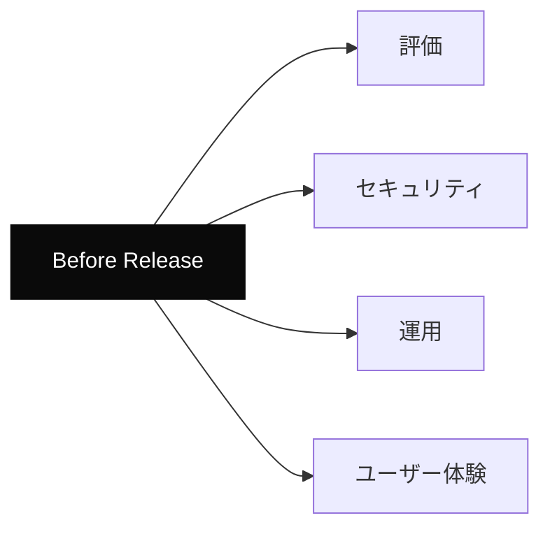
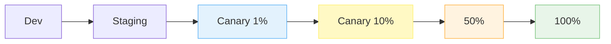

---
tags:
  - release
  - checklist
  - llm
  - production
---

# LLM 機能を本番リリースする前のチェックリスト

Tech Notes
#release
#checklist
#llm
#production
updated 2026-04-13
4 min read

LLM を組み込んだ機能を本番にリリースする前に、**従来のアプリと違う観点**でチェックする項目がある。見落とすと、本番で想定外の事故を起こす。

### リリース前チェックの構造

### カテゴリ別チェックリスト

**評価**

- [ ] 評価セットで合格ラインを超えている（Patterns「評価セット設計の 6 つのアンチパターン」参照）
- [ ] 成功例・失敗例・境界例を網羅している
- [ ] 本番データのサンプルで動作確認した
- [ ] 回帰テスト（前バージョンからの劣化）を確認した

**セキュリティ**

- [ ] プロンプトインジェクション対策（Concepts「プロンプトインジェクション」参照）
- [ ] 入力バリデーション・長さ制限
- [ ] 出力フィルタ（機密情報・不適切表現）
- [ ] API キーの管理と漏洩防止
- [ ] ログにセンシティブ情報が残らない

**運用**

- [ ] レート制限対応（Tech Notes「レート制限との付き合い方」参照）
- [ ] エラーハンドリングとフォールバック
- [ ] タイムアウト設定
- [ ] ログ記録（Tech Notes「LLM アプリのログ設計」参照）
- [ ] アラート設定
- [ ] コスト監視ダッシュボード

**ユーザー体験**

- [ ] AI 生成であることの明示
- [ ] ストリーミング表示（長い出力の場合）
- [ ] ローディング状態の見せ方
- [ ] エラー時のメッセージ
- [ ] 再試行 UI
- [ ] フィードバック経路（誤情報を報告できる）

### 段階的リリース

一気に 100% に向けず、段階的に比率を上げる。各段階でメトリクスを確認し、異常があればロールバック。

### リリース後の 24-72 時間

**初期監視で見るべき指標**

- エラー率の推移
- 平均レイテンシと P95
- コスト / 時間（予算超過していないか）
- ユーザーからの問い合わせ増加
- ログに異常パターンがないか

**気付きの受け皿を用意する**

- オンコール担当者を決める
- 異常時の連絡経路を確認
- ロールバック手順を手元に置く

### アンチパターン

**1. 評価なしのリリース**

「動いたからリリース」は事故のもと。必ず評価セットを回す。

**2. フォールバックなしで依存**

LLM API が落ちたら機能全停止、はユーザー体験を大きく毀損する。**縮退運転の設計**が必要。

**3. コスト制限なし**

月額予算を設定せずにリリースすると、想定外のコスト増で驚く。API 側とアプリ側の両方で制限を設ける。

**4. 一気に全ユーザーへ**

1% カナリアから始める習慣がないと、本番で事故が起きたときの影響が大きくなる。

### チェックリスト（サマリ）

- [ ] 評価セットで合格
- [ ] セキュリティ対策完了
- [ ] ログとアラート設定済み
- [ ] フォールバック実装済み
- [ ] 段階的リリース計画あり
- [ ] ロールバック手順確立
- [ ] コスト監視ダッシュボード稼働
- [ ] ユーザー向け UX が丁寧

### まとめ

LLM 機能のリリースは、通常のアプリ機能より**評価・セキュリティ・運用**の 3 点で追加工数が必要。チェックリストで抜け漏れを防ぎ、段階的に本番投入する。

## 関連エントリ

- [LLM API のレート制限との付き合い方](llm-api-のレート制限との付き合い方.md)
- [LLM アプリのログ設計で残すべき 5 項目](llm-アプリのログ設計で残すべき-5-項目.md)
- [Eval-Driven Development — LLM 機能開発は評価から始める](../concepts/eval-driven-development-llm-機能開発は評価から始める.md)

  
← [実装言語を選ぶ前に環境前提を確認する](実装言語を選ぶ前に環境前提を確認する.md)

  
[SQLite FTS5 で日本語を全文検索する](sqlite-fts5-で日本語を全文検索する.md) →

