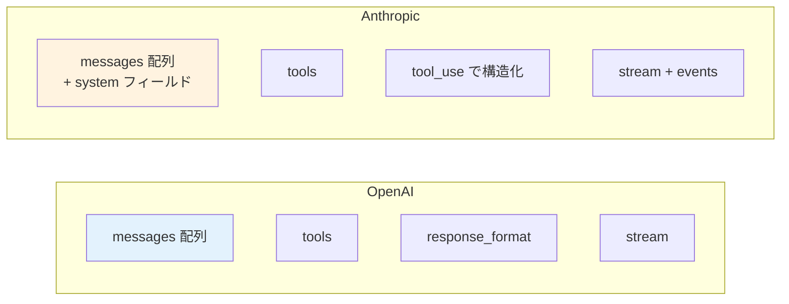
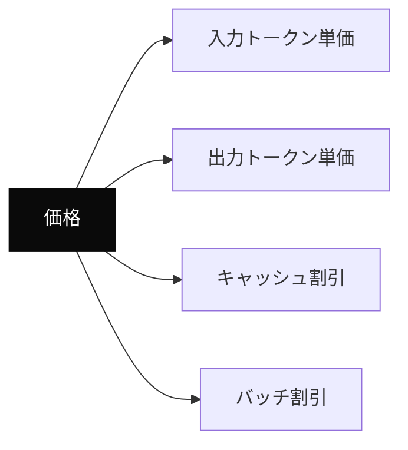

---
tags:
  - openai
  - anthropic
  - api-diff
  - reference
---

# OpenAI と Anthropic API の主要差分

Tech Notes
#openai
#anthropic
#api-diff
#reference
updated 2026-04-13
6 min read

OpenAI API と Anthropic API は**多くの概念が共通**するが、細かな仕様差がある。両方を扱う実装で引っかかるポイントを整理。

### 主要な差分マップ

### API 構造の違い

**メッセージとシステムプロンプト**

| 項目 | OpenAI | Anthropic |
|------|--------|-----------|
| システムプロンプト | `messages` 内の role:"system" | トップレベルの `system` フィールド |
| ユーザー・アシスタント | `messages` 内の role:"user"/"assistant" | 同じ |
| メッセージ順序 | 任意 | user と assistant が交互である必要 |

Anthropic では system を別フィールドに置く。コードを共通化するなら**抽象化層で吸収**する。

**Tool Use / Function Calling**

OpenAI:

    {
      "tools": [
        {"type": "function", "function": {"name": "...", "parameters": {...}}}
      ]
    }

Anthropic:

    {
      "tools": [
        {"name": "...", "description": "...", "input_schema": {...}}
      ]
    }

スキーマの書き方が違う。`parameters` vs `input_schema`。

**構造化出力**

- **OpenAI**: `response_format: {type: "json_object"}` or `{type: "json_schema", json_schema: {...}}`
- **Anthropic**: Tool Use を利用して、スキーマを満たす引数を返させる方式

Anthropic には JSON Mode 相当の直接機能は少ない（ツール経由で実現）。

### ストリーミングのイベント形式

**OpenAI**: SSE で `data: {"choices": [{"delta": {"content": "..."}}]}` を流し続ける。

**Anthropic**: より細かいイベントタイプが定義されている。
- `message_start`
- `content_block_start`
- `content_block_delta`
- `content_block_stop`
- `message_delta`
- `message_stop`

ストリーミング処理を書くときは、それぞれのイベントに応じた処理が必要。

### 料金モデル

- 出力単価は入力より高い（両社とも）
- Anthropic は**プロンプトキャッシュを明示的にマーク**する仕組み（`cache_control`）
- OpenAI のキャッシュは**自動**（同じ先頭を再利用）
- バッチ API は両社 50% 割引

### モデル特性の傾向

|  | OpenAI（4o / o3） | Anthropic（Opus / Sonnet） |
|---|---|---|
| 口調 | 簡潔寄り | 丁寧・冗長寄り |
| 指示追従 | 高い | 非常に高い |
| 創造性 | 高い | 高い |
| コード生成 | 高い | 高い |
| 日本語品質 | 高い | 高い |

細かな違いは用途で評価する必要がある。評価セットで測るべき。

### 実装のコツ

**1. 抽象化層を必ず置く**

    class LLMClient:
      def generate(self, system, messages, tools=None): ...

    class OpenAIClient(LLMClient): ...
    class AnthropicClient(LLMClient): ...

プロバイダー依存のコードをラッパーに閉じ込める。切り替えが楽になる。

**2. SDK の型にはまだ互換性がない**

OpenAI SDK（openai）と Anthropic SDK（anthropic）は型が違う。共通化したいなら LangChain 等のラッパーを使うか、自前で型を定義する。

**3. エラー応答の形式が違う**

- OpenAI: `{error: {type, code, message}}`
- Anthropic: `{type: "error", error: {type, message}}`

エラーハンドリングも抽象化層で吸収する。

### 参考にすべきドキュメント

- OpenAI: <https://platform.openai.com/docs>
- Anthropic: <https://docs.anthropic.com>

### まとめ

共通概念が多いが、**細部の仕様は必ず違う**。並行運用するなら抽象化層を早めに入れ、SDK 差分を閉じ込める設計にする。

## 関連エントリ

- [LLM モデル / プロバイダー切り替え時の互換性問題と段階移行](../case-studies/llm-モデル-プロバイダー切り替え時の互換性問題と段階移行.md)
- [Next.js で LLM のストリーミング応答を扱う実装パターン](../case-studies/nextjs-で-llm-のストリーミング応答を扱う実装パターン.md)
- [Edge Runtime vs Node Runtime の使い分け](edge-runtime-vs-node-runtime-の使い分け.md)

  
← [LLM 機能を本番リリースする前のチェックリスト](llm-機能を本番リリースする前のチェックリスト.md)

  
[SQLite FTS5 で日本語を全文検索する](sqlite-fts5-で日本語を全文検索する.md) →

