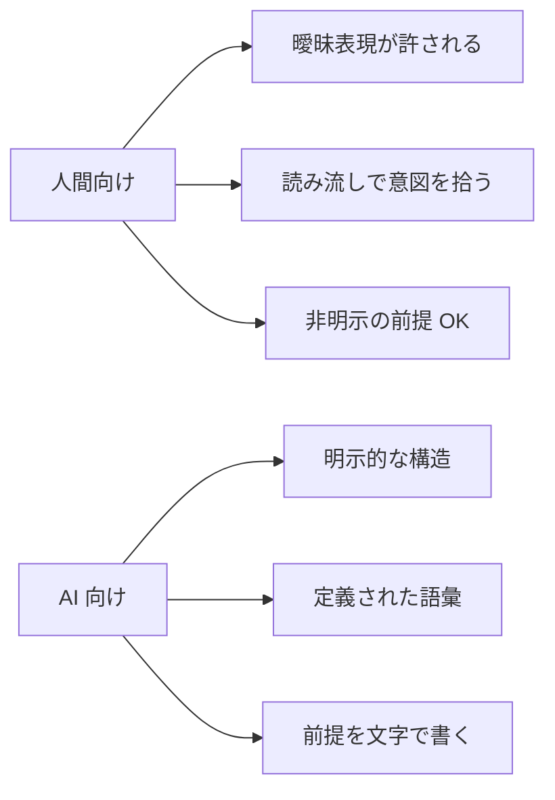
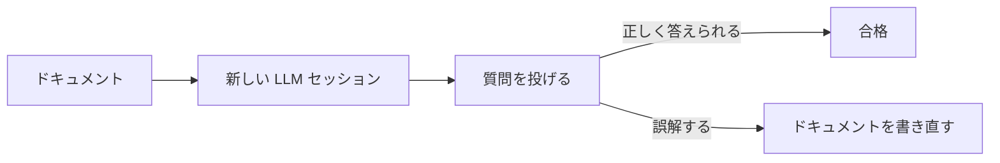

---
tags:
  - documentation
  - ai-first
  - technique
---

# AI エージェントが読みやすいドキュメントの書き方

Techniques
#documentation
#ai-first
#technique
updated 2026-04-13
4 min read

AI エージェントが参照するドキュメントは、**人間向けと書き方を変える**と精度が大きく上がる。人間が読みやすい文章と、AI が解釈しやすい文章は、重なるが同じではない。

### AI が解釈しやすい書き方

### 8 つのコツ

**1. 見出し構造を厳密にする**

`#` `##` `###` の階層を守り、**飛ばさない**。AI は見出し階層で文書構造を理解する。

    # タイトル
    ## 主要セクション
    ### サブセクション
    #### 詳細（必要に応じて）

**2. 各セクションに意図を書く**

「このセクションで伝えたいこと」を冒頭 1 文で書く。

    ## エラーハンドリング

    以下の 3 つのパターンでエラーを処理する。
    ...

**3. 箇条書きを使う**

長い文を 3 つのポイントに分解する。AI にとって**構造化された情報の方が抽出しやすい**。

**4. 定義と引用を明示する**

専門用語・略語は**初出時に定義**する。AI が勝手に推測して間違える余地を減らす。

    MCP (Model Context Protocol): LLM に外部ツールを接続するためのプロトコル。

**5. コード例とその意図を併記**

    # 正しい書き方
    client = OpenAI(api_key=os.environ["OPENAI_API_KEY"])
    # 環境変数から取得することで、コードに秘密情報を残さない

「なぜこう書くか」を添えると、AI が類似ケースで応用できる。

**6. 禁止と推奨を対で書く**

    推奨: タイムスタンプはユーザーメッセージ側に置く
    NG: CLAUDE.md に「現在時刻」を書くとキャッシュが無効化される

Before/After や Do/Don't のペアは AI の学習に有効。

**7. FAQ を含める**

「〇〇したいときは?」というユーザー視点の Q&A を入れる。AI が似た質問を受けたときに、この FAQ を引用できる。

**8. メタデータを表で持つ**

    | 項目 | 値 |
    |------|-----|
    | バージョン | 2.1 |
    | 更新日 | 2026-04-14 |
    | 依存 | Node 20+, TypeScript 5.3+ |

表形式は AI が機械的に抽出しやすい。

### 避けるべき書き方

**1. 曖昧な表現**

- 「適切に処理する」→「このステップを実行する: A, B, C」
- 「だいたい 100 件くらい」→「90〜110 件」
- 「なるべく早く」→「5 秒以内」

**2. 暗黙の前提**

- 「普通は〇〇する」→「プロジェクト方針により〇〇する（ADR 003 参照）」
- 「ご存知の通り」→ 前提を明示的に書く

**3. 代名詞の多用**

- 「これをあれに渡す」→「<関数 X> を <クラス Y> のメソッド Z に渡す」

AI は長いコンテキストで**代名詞の指す対象を見失いがち**。

### テストする方法

書いたドキュメントを、**別のセッション**の LLM に読ませて、「このドキュメントから ◯◯ を抽出して」と聞く。正しく抽出できなければ、書き方に問題がある。

### 運用のコツ

- **ドキュメントの Lint**: Markdown 構造のチェックツールで機械的に品質を保つ
- **LLM チェック**: 新規ドキュメントは LLM に読ませて「曖昧な箇所を指摘して」と依頼
- **定期的な見直し**: 3 ヶ月に 1 回、古くなった前提や曖昧な表現を棚卸し

### チェックリスト

- [ ] 見出し階層が飛んでいない
- [ ] 各セクションに意図を書いた
- [ ] 専門用語を初出時に定義した
- [ ] 推奨と NG を対で書いた
- [ ] 曖昧表現を具体的な数値・ルールに置き換えた
- [ ] 別 LLM に読ませて抽出テストした

### まとめ

AI 向けドキュメントは**構造・明示・具体**の 3 点がキー。人間も読みやすくなる副次効果があるので、一石二鳥。

## 関連エントリ

- [Few-shot Examples の効果的な設計](few-shot-examples-の効果的な設計.md)
- [LLM ツール定義のスキーマ設計](llm-ツール定義のスキーマ設計.md)
- [LLM-as-Judge — 評価者 LLM の組み立て方](llm-as-judge-評価者-llm-の組み立て方.md)

  
← [エージェントのメモリ設計 (短期・中期・長期)](エージェントのメモリ設計-短期中期長期.md)

  
[Claude Code を日々使い倒す 10 の小技](claude-code-を日々使い倒す-10-の小技.md) →

