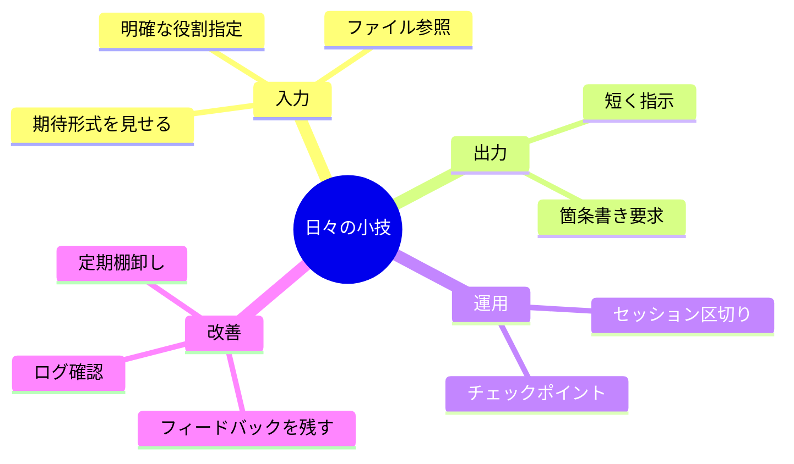
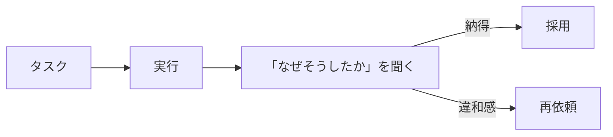

---
tags:
  - daily
  - workflow
  - tips
  - claude-code
---

# Claude Code を日々使い倒す 10 の小技

Techniques
#daily
#workflow
#tips
#claude-code
updated 2026-04-13
3 min read

Claude Code を日々の開発で使い倒している中で気付いた、**小さいけど効く 10 の実践**。1 つ 1 つは小さいが、合計すると体感が大きく変わる。

### 10 の小技

## 1. 最初に「役割」を明示する

「あなたは <役割> です」を 1 行入れるだけで、回答の質と方向性が安定する。

    あなたはこのプロジェクトの
    TypeScript / Next.js 開発エージェントです。

## 2. ファイルを「開いて」と指示する

「ファイルを見て」ではなく「`src/xxx.ts` を開いて読んでから判断して」と具体的に書く。

## 3. 期待する出力形式を先に見せる

長々説明するより、**1 つ例を見せる**方が早く伝わる。

    こういう形式で返してください:
    - 問題: 

    - 原因: <root cause>
    - 修正: <proposed fix>

## 4. 「短く」を具体的に指示

「簡潔に」は曖昧。「3 文以内で」「100 字以内で」と**数値で**指示。

## 5. セッションを区切る

目的が変わったら**新しいセッション**を開始。同じセッションで違うタスクを続けると、文脈が混ざって品質が落ちる。

## 6. チェックポイントをこまめに

15 分動いたら git commit、または「現状を要約してファイルに書いて」。死んでも復帰できる状態を保つ。

## 7. フィードバックをその場で残す

「ここはこうしてほしかった」「このやり方は良かった」を**セッション中に明示的に伝える**。CLAUDE.md や MEMORY.md に書くと次回から反映される。

## 8. ログで振り返る

週 1 回、直近のセッションログを眺めて、**同じ失敗を繰り返していないか**確認する。見つけたら CLAUDE.md に追加。

## 9. MCP を定期棚卸し

3 ヶ月に 1 回、有効な MCP を見直す。使っていないものは無効化。**常に 6 本以下**を目指す。

## 10. 「なぜ」を説明させる

修正や判断に対して「なぜそうしたか」を Claude に説明させる。**推論過程を読むと、納得できない箇所**が見える。

### 実践の順序

**今日からできる**: 1, 3, 4, 5

**1 週間で習慣化**: 2, 6, 10

**月次で見直す**: 7, 8, 9

### 効果

小技 1 個の効果は小さくても、**10 個の組み合わせ**で日々のセッション品質が大きく変わる。1 週間試して体感を確かめるのがおすすめ。

### 関連

- CLAUDE.md は「索引」に徹する（Patterns）
- 二役レビューの実装パターン（Techniques）
- 長時間セッションで遭遇する 6 つの失敗パターン（Patterns）

## 関連エントリ

- [エージェントと協業する 1 日のワークフロー](エージェントと協業する-1-日のワークフロー.md)
- [Claude Code を使った効率的な不具合調査](../case-studies/claude-code-を使った効率的な不具合調査.md)
- [ADR 参照コマンドによる意思決定の継承](../tools/adr-参照コマンドによる意思決定の継承.md)

  <a class="prev" href="../ai-エージェントが読みやすいドキュメントの書き方/">←AI エージェントが読みやすいドキュメントの書き方</a>
  <a class="next" href="../エージェントと協業する-1-日のワークフロー/">エージェントと協業する 1 日のワークフロー→</a>

