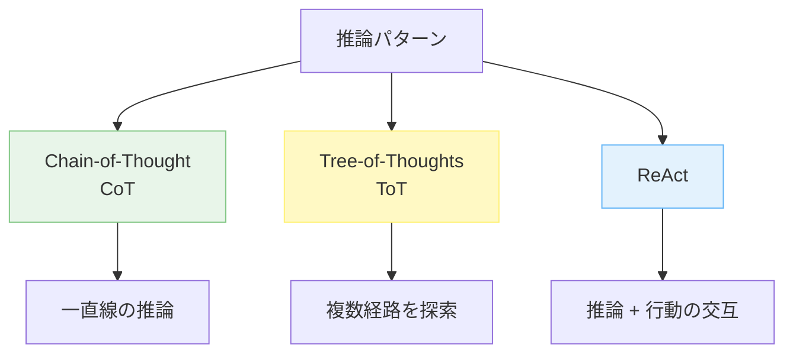
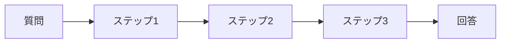
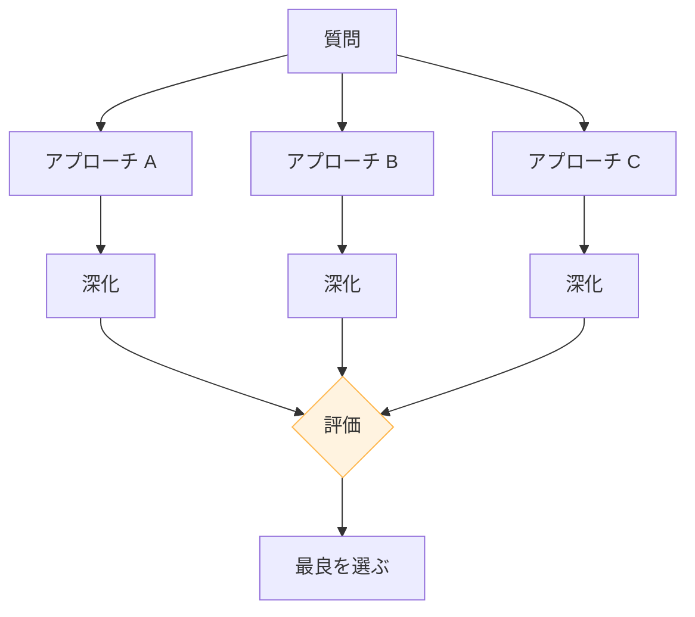
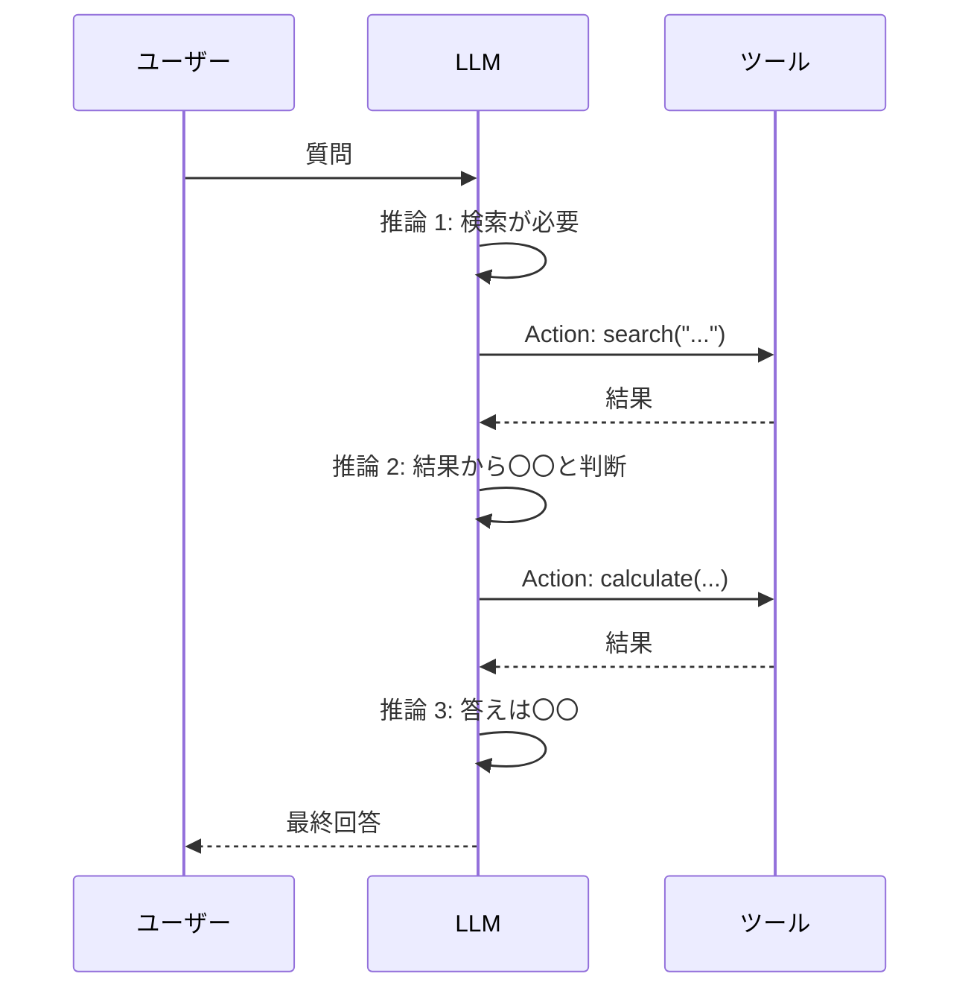

---
tags:
  - reasoning
  - cot
  - react
  - prompt-technique
---

# CoT・ToT・ReAct — 推論パターンの使い分け

Techniques
#reasoning
#cot
#react
#prompt-technique
updated 2026-04-13
5 min read

LLM の推論能力を引き出すパターンとして、**Chain-of-Thought (CoT)**、**Tree-of-Thoughts (ToT)**、**ReAct** が筆者的。用途に応じて使い分ける。

### 3 つのパターンの位置づけ

### 1. Chain-of-Thought (CoT)

**何か**: 答えを出す前に、**推論の過程を書き出させる**手法。「ステップバイステップで考えて」が典型的な指示。

**指示例**:

    この問題を、段階的に考えて解いてください。
    1. 何が問われているかを明確にする
    2. 必要な情報を整理する
    3. 一歩ずつ計算する
    4. 最終回答を出す

**向いている用途**: 数学問題、論理推論、多段階の推理が必要なタスク

**欠点**: トークン消費が増える。単純なタスクでは過剰。

### 2. Tree-of-Thoughts (ToT)

**何か**: 複数の推論経路を並列に展開し、**途中で評価して選別**する手法。

**実装**: 複数のアプローチを LLM に生成させ、別の LLM に評価させる、を反復する。

**向いている用途**: 創造的タスク、戦略立案、複数の正解があるタスク

**欠点**: CoT より更にコストが高い。単純化のために数経路に絞る。

### 3. ReAct (Reasoning + Acting)

**何か**: 推論（Thought）と行動（Action）を交互に繰り返す。ツール利用と相性が良い。

**指示例**:

    以下の形式で答えてください:

    Thought: <次に何をすべきかの推論>
    Action: <実行するツール>
    Observation: <ツールの結果>
    Thought: <次の推論>
    ...
    Final Answer: <最終回答>

**向いている用途**: ツール利用が必要なタスク、外部情報を参照する調査、ReAct-style Agent

**欠点**: ツール設計に依存する。設計が悪いと無限ループする。

### 使い分けの目安

| タスク種別 | CoT | ToT | ReAct |
|-----------|-----|-----|-------|
| 数学・論理 | ◎ | ○ | △ |
| 創造的タスク | ○ | ◎ | △ |
| 調査・リサーチ | ○ | ○ | ◎ |
| ツール利用 | △ | △ | ◎ |
| 単純な分類 | △ | × | × |

### 実装のコツ

**1. デフォルトは CoT**

「まず CoT、足りなければ他へ」で多くのケースは足りる。シンプルさを優先。

**2. コストを意識する**

ToT や ReAct は CoT の数倍のコスト。**本当に必要か**を評価する。

**3. 推論を見せるか隠すか**

エンドユーザーには推論過程を隠すことが多い。ログや開発者には見せる。プロダクト設計で使い分ける。

**4. 推論だけ先に生成**

CoT の推論部分だけを先に生成し、それを別の呼び出しに渡して最終回答を作る**二段階設計**も有効。

### 落とし穴

- **CoT を過信**: CoT は万能ではない。単純タスクで過剰に使うとコストと時間が無駄
- **ReAct で無限ループ**: ツール呼び出しが終わらない。**最大ステップ数**を必ず設定
- **ToT で計算量爆発**: 経路数を制限せずに深くすると、コストが急増
- **推論を検証しない**: CoT の推論部分自体が間違っていることもある。出力だけでなく推論の妥当性も評価する

### まとめ

CoT・ToT・ReAct は**どれも強力だが得意分野が違う**。単純な推論は CoT、探索が必要なら ToT、ツール利用なら ReAct。**タスクに合わせて選ぶ**のが正解。

## 関連エントリ

- [Few-shot Examples の効果的な設計](few-shot-examples-の効果的な設計.md)
- [LLM から構造化 JSON を確実に取り出す](llm-から構造化-json-を確実に取り出す.md)
- [LLM コストを減らす 7 つの手法 (優先順位つき)](llm-コストを減らす-7-つの手法-優先順位つき.md)

  
← [Few-shot Examples の効果的な設計](few-shot-examples-の効果的な設計.md)

  
[LLM から構造化 JSON を確実に取り出す](llm-から構造化-json-を確実に取り出す.md) →

