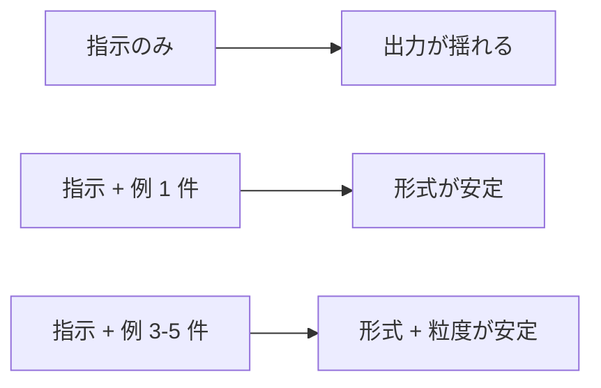

---
tags:
  - prompt-design
  - few-shot
  - technique
---

# Few-shot Examples の効果的な設計

Techniques
#prompt-design
#few-shot
#technique
updated 2026-04-13
3 min read

LLM に「こういう形式で答えてほしい」と伝える最強の手段は、**例を見せること**。Few-shot examples を正しく設計すると、出力の品質と一貫性が大きく変わる。

### なぜ例示が効くか

自然言語の指示は曖昧に解釈される。例を見せると、**形式・トーン・粒度** が一発で伝わる。

### 件数の目安

| 件数 | 効果 | コスト |
|------|------|--------|
| 0 件（zero-shot） | 指示のみで動く | 最小 |
| 1 件 | 形式が安定 | 小 |
| 3-5 件 | 形式 + 粒度 + トーンが安定 | 中 |
| 10 件以上 | ほぼ変わらない・むしろノイズ | 大 |

**出発点**: 3 件。効果が足りなければ 5 件。10 件超えても大抵は改善しない。

### 良い例の条件

**1. 多様性**

似た例ばかりだと一つの形にしか答えなくなる。**入力のバリエーション**を散らす。

    例 1: 短い入力 → 短い出力
    例 2: 長い入力 → 長い出力
    例 3: 曖昧な入力 → 確認を求める出力

**2. エッジケースを含む**

「こういう入力が来たらこう返す」の指示が難しいケースを例に入れる。

    例: 不明な入力 → 「情報が不足しています」と返す

**3. フォーマットの一貫性**

全ての例で**同じフォーマット**を使う。揺らぐとそれが許容されると LLM が学習する。

### アンチパターン

**1. 例を実タスクと混ぜる**

例の中に本番の入力と似たものを入れると、LLM がその例の出力を流用してしまう。

- **対策**: 例には明確に架空・筆者的なデータを使う

**2. 例が長すぎる**

例 1 件で 500 トークンを使うと、5 件で 2500 トークン。コンテキストを圧迫する。

- **対策**: 例は**最小限の長さ**に抑える。筆者性を保ちつつ短くする

**3. 例の品質が低い**

例自体に誤りがあると、LLM はそれを正解として学ぶ。

- **対策**: 例は手作業で丁寧に作る。LLM に作らせて使わない

**4. 例と指示が矛盾する**

指示に「丁寧な口調で」と書いて、例がフランクだと、LLM はどちらに従えばいいか分からない。

- **対策**: 指示と例の一貫性を必ず確認する

### 実装パターン

    [SYSTEM]
    あなたは要件を JSON にまとめるアシスタントです。

    以下の形式で回答してください。

    ## 例 1
    入力: ユーザーがログインできるようにしたい
    出力: {"feature": "login", "priority": "high", "estimated_days": 3}

    ## 例 2
    入力: ダッシュボードに最新の売上を表示したい
    出力: {"feature": "sales_dashboard", "priority": "medium", "estimated_days": 5}

    ## 例 3
    入力: 何か良いアイデアありませんか？
    出力: {"error": "要件が不明確です。達成したいゴールを教えてください"}

    [USER]
    <実際の入力>

### まとめ

Few-shot は**プロンプトエンジニアリングで最も ROI が高い**手法。3 件の良い例は、長い指示より効く。

## 関連エントリ

- [AI エージェントが読みやすいドキュメントの書き方](ai-エージェントが読みやすいドキュメントの書き方.md)
- [LLM ツール定義のスキーマ設計](llm-ツール定義のスキーマ設計.md)
- [LLM-as-Judge — 評価者 LLM の組み立て方](llm-as-judge-評価者-llm-の組み立て方.md)

  

  
[CoT・ToT・ReAct — 推論パターンの使い分け](cottotreact-推論パターンの使い分け.md) →

