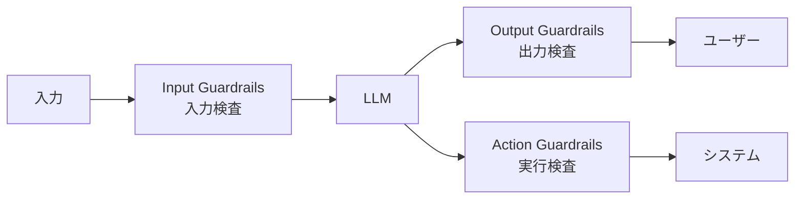
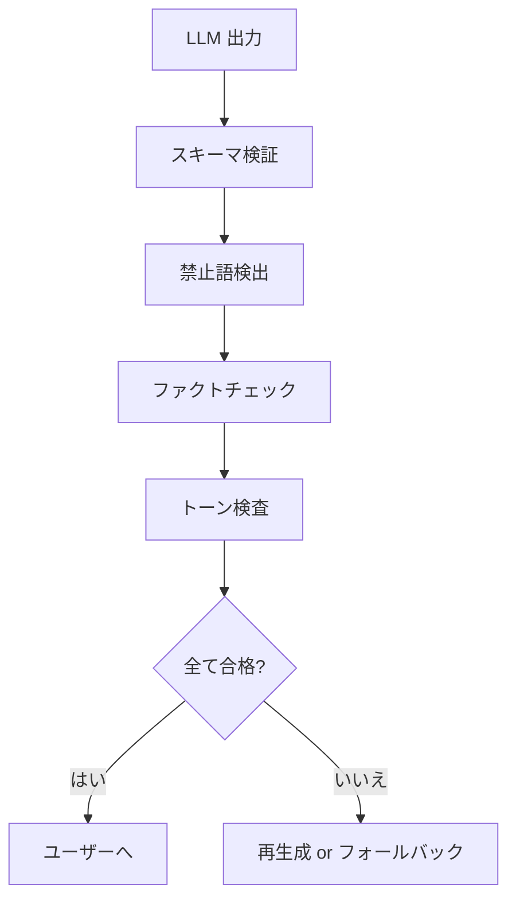
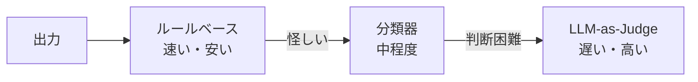

---
tags:
  - guardrails
  - safety
  - output-control
---

# Guardrails — LLM 出力を決定論的に制御する仕組み

Techniques
#guardrails
#safety
#output-control
updated 2026-04-13
6 min read

LLM の出力を**決定論的に制御**するための仕組みを総称して Guardrails（ガードレール）と呼ぶ。自由な生成と安全な運用の両立に必須。

### Guardrails の 3 層

### 1. Input Guardrails（入力側）

LLM に渡す前に入力を検査・整形する。

**典型的なチェック**:

- 長さ制限（超過したらトリム or 拒否）
- 文字種チェック（バイナリ混入等）
- 既知の攻撃パターン検出（「前の指示を無視」等）
- PII（個人情報）検出
- トピック外の検出（専門分野外の質問を拒否）

    def input_guardrail(text: str) -> Result:
        if len(text) > MAX_LENGTH:
            return reject("too long")
        if contains_injection_pattern(text):
            return reject("injection detected")
        if contains_pii(text):
            return mask_pii(text)
        return allow(text)

### 2. Output Guardrails（出力側）

LLM の出力を検査して、問題があれば修正 or 再生成する。

**典型的なチェック**:

- スキーマ遵守（JSON 構造が正しいか）
- 禁止語検出（差別表現、機密情報等）
- ハルシネーション検出（主張に出典があるか）
- トーン検査（丁寧度、攻撃性）
- 長さ制限（超長い出力を切り詰め）

### 3. Action Guardrails（実行側）

LLM がツールを呼び出す場合、**実行前に安全性を検査**する。

**典型的なチェック**:

- 許可されたツールか
- 引数が妥当か（例: SQL インジェクションの可能性）
- 副作用の大きさ（削除・送信・決済は承認必須）
- 実行回数上限（無限ループ防止）

### 実装方法

**1. ルールベース**

正規表現・文字列マッチ・スキーマ検証等。高速・決定論的。

    import re
    BLACKLIST = [r"社外秘", r"confidential", r"\b(API|secret)[_-]?key\b"]

    def contains_restricted(text: str) -> bool:
        return any(re.search(p, text, re.IGNORECASE) for p in BLACKLIST)

**2. 分類器**

小さいモデルや専用分類器で判定。ルールベースで取れないニュアンスに対応。

**3. LLM-as-Judge**

別の LLM に検査させる。高精度だがコストが上がる。主観的な軸（トーン・丁寧度）に向く。

**4. ハイブリッド**

ルールベースで粗く弾き、残りを分類器・LLM で判定。**コストと精度のバランス**。

### 失敗時の対応

Guardrail に引っかかった場合の挙動を事前に決める。

- **Reject**: 処理を拒否し、ユーザーにエラー表示
- **Retry**: LLM に再生成させる（最大回数を設定）
- **Fallback**: 定型文やデフォルト値を返す
- **Log + Pass**: 警告ログだけ残して通過（軽微な違反の場合）

### よくあるライブラリ / フレームワーク

- **NeMo Guardrails** (NVIDIA)
- **Guardrails AI**
- **LlamaGuard** (Meta)
- **Presidio** (Microsoft, PII 検出特化)

フルスクラッチで書かず、**既存ツールを起点に**カスタマイズする方が速い。

### アンチパターン

**1. 全てを LLM で検査**

コストがかかる。**ルールベースで取れるものは安いチェックで弾く**。

**2. Guardrail なしで本番運用**

「モデルが賢いから大丈夫」ではない。必ず入れる。

**3. Guardrail を公開する**

攻撃者に Guardrail の仕組みを知られると回避される。**詳細は非公開**で運用。

**4. false positive の無視**

本来許可すべき入力を弾いてしまう率を計測しないと、ユーザー体験が悪化する。

### 測定すべき指標

- **検出率**: 本当に危険な入出力のうち、何% を Guardrail が捕捉するか
- **誤検出率**: 安全な入出力を誤って拒否する率
- **レイテンシ**: Guardrail による処理時間の増加
- **コスト**: Guardrail に使う LLM 呼び出しの料金

定期的に計測して、**閾値を調整**する。

### チェックリスト

- [ ] 入力・出力・実行の 3 層で Guardrail を設置した
- [ ] ルールベース / 分類器 / LLM の使い分けを決めた
- [ ] 失敗時の挙動（reject/retry/fallback）を決めた
- [ ] 既存ツールを評価した上でカスタマイズした
- [ ] 検出率・誤検出率を計測している
- [ ] Guardrail の詳細は非公開にしている

### まとめ

Guardrails は LLM 運用の**安全弁**。3 層（入力・出力・実行）で設計し、ルールベース + 分類器 + LLM のハイブリッドで構築する。**最初から必須要件**として組み込む。

## 関連エントリ

- [AI エージェントが読みやすいドキュメントの書き方](ai-エージェントが読みやすいドキュメントの書き方.md)
- [Claude Code を日々使い倒す 10 の小技](claude-code-を日々使い倒す-10-の小技.md)
- [CoT・ToT・ReAct — 推論パターンの使い分け](cottotreact-推論パターンの使い分け.md)

  <a class="prev" href="../llm-レッドチーミング-意図的な攻撃で安全性を検証する/">←LLM レッドチーミング — 意図的な攻撃で安全性を検証する</a>
  <a class="next" href="../エージェントのメモリ設計-短期中期長期/">エージェントのメモリ設計 (短期・中期・長期)→</a>

