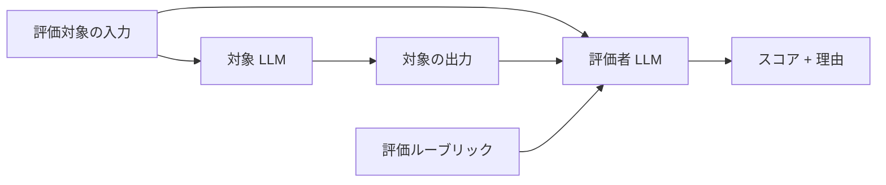
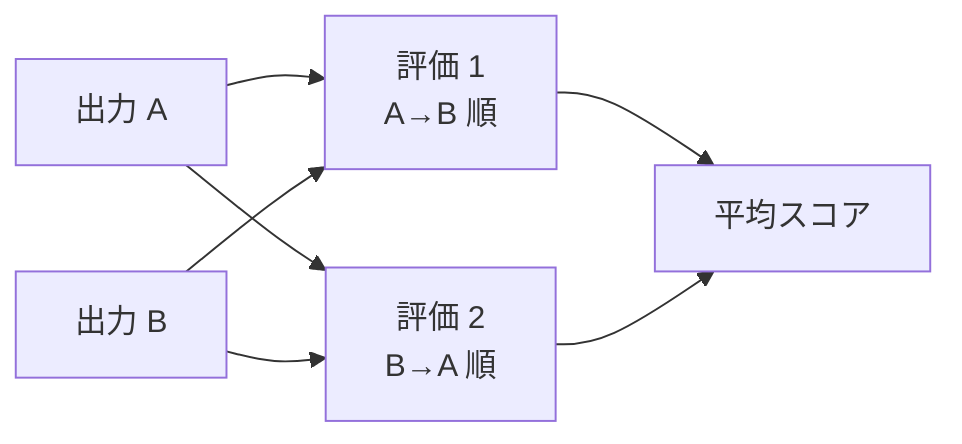
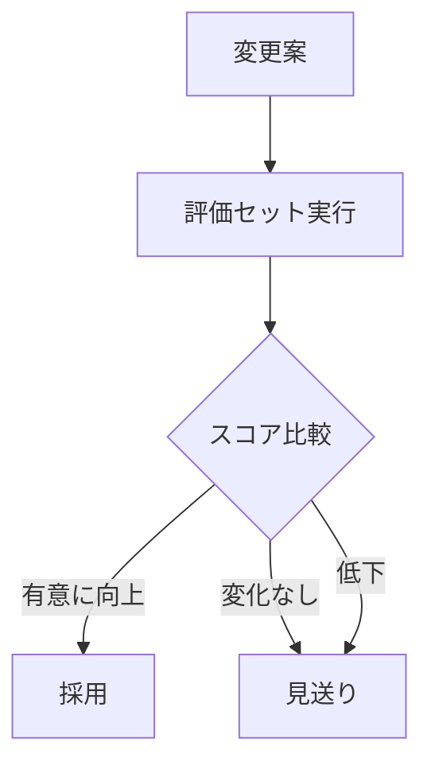

---
tags:
  - eval
  - llm-judge
  - review
  - technique
---

# LLM-as-Judge — 評価者 LLM の組み立て方

Techniques
#eval
#llm-judge
#review
#technique
updated 2026-04-13
3 min read

LLM の出力品質を別の LLM に評価させる手法。主観的な評価軸（トーン、読みやすさ、含意の適切さ）を自動化できる。ただし評価者自身にバイアスがあるため、実装には注意が要る。

### 基本構造

### 評価ルーブリックの設計

評価者に「良いかどうか」を聞くだけでは不安定。**評価軸を分解し、軸ごとに定義と満点基準を明示する**。

    ## 評価軸
    1. 事実正確性（0-5）
      - 5: 全ての事実が検証可能で正しい
      - 3: 大半は正しいが、1-2 箇所の誤り
      - 1: 複数の事実誤認
      - 0: 全体的に誤り
    2. 形式遵守（0-5）
      - 5: 指定フォーマットを完全に守っている
      - ...

### バイアスを減らす工夫

**1. 位置バイアスを避ける**

2 つの出力を比較させる場合、AB / BA の両順で評価して平均を取る。LLM は最初に見た選択肢を優先しがち。

**2. スコアだけでなく理由を出させる**

`score: 7` とだけ返させると、理由なしで一貫性のないスコアを吐く。`reasoning → score` の順で返させると、推論の一貫性が上がる。

**3. モデルを変える**

評価対象と評価者で別モデルを使う。同じモデルだと自己一致バイアスが出やすい。

**4. 人間によるスポットチェック**

評価者の判定を定期的にサンプリングして人間が確認する。評価者自身の劣化を検出する。

### よくあるアンチパターン

- **評価者プロンプトに対象の出力を混ぜて書く**: プロンプトインジェクションで評価結果が乗っ取られる
- **主観的な語彙しか使わない**: 「良い」「自然」「適切」だけではスコアが揺れる。**具体的な定義**が必要
- **評価セットが小さい**: 10 件で平均を出しても、ノイズに埋もれる。**最低 50〜100 件**欲しい

### 運用パターン

プロンプト改善や新モデル導入の前後で、評価セットを回して回帰をチェックする。スコアが有意に下がったら採用を見送る。

### まとめ

LLM-as-Judge は**完全な代替ではなく、人間の目を補う仕組み**。自動化できる部分だけ自動化し、最終判定は人間が握る運用が現実的。

## 関連エントリ

- [AI エージェントが読みやすいドキュメントの書き方](ai-エージェントが読みやすいドキュメントの書き方.md)
- [Few-shot Examples の効果的な設計](few-shot-examples-の効果的な設計.md)
- [LLM ツール定義のスキーマ設計](llm-ツール定義のスキーマ設計.md)

  <a class="prev" href="../マルチエージェント組織の4つの設計教訓/">←マルチエージェント組織の4つの設計教訓</a>
  <a class="next" href="../rag-のチャンクサイズを選ぶ基準/">RAG のチャンクサイズを選ぶ基準→</a>

