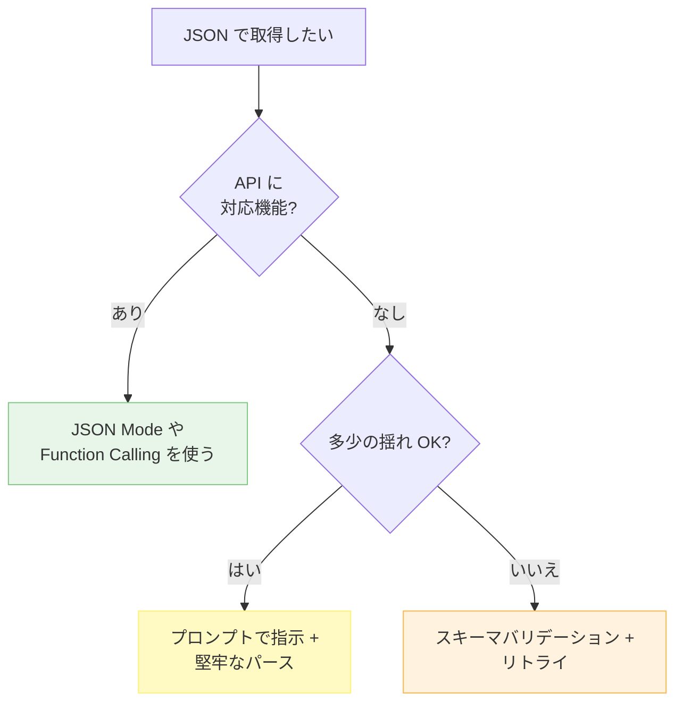
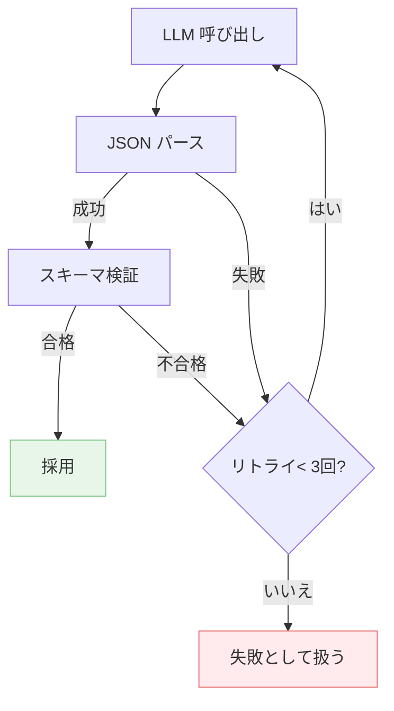

---
tags:
  - json-mode
  - structured-output
  - llm
---

# LLM から構造化 JSON を確実に取り出す

<div class="dnk-meta" markdown>
<span class="pill cat">Techniques</span>
<span class="pill">#json-mode</span>
<span class="pill">#structured-output</span>
<span class="pill">#llm</span>
<span class="pill">updated 2026-04-13</span>
<span class="pill">5 min read</span>
</div>

LLM から構造化データ（JSON）を取り出す際、**JSON Mode** や **Function Calling** を使わないと、プレーンテキストの中に JSON が混じって返ってきて、パースに失敗しやすい。確実に取り出す方法を整理する。

### 3 つのアプローチ



### アプローチ 1: JSON Mode / Function Calling

OpenAI, Anthropic 等の主要 API は JSON Mode またはそれに相当する機能を提供する。これを使えば、**文法的に正しい JSON** が保証される（スキーマ遵守は別問題）。

    # OpenAI 例
    response = openai.chat.completions.create(
      model="gpt-4o",
      response_format={"type": "json_object"},
      messages=[...]
    )

- **利点**: JSON として parse できることが保証される
- **欠点**: キーの有無・型までは保証されない。スキーマバリデーションは別途必要

### アプローチ 2: スキーマ指定（Structured Output）

JSON Schema を渡せる API（OpenAI の `response_format: json_schema` 等）を使えば、**型やキーの存在**まで保証できる。

    response_format = {
      "type": "json_schema",
      "json_schema": {
        "name": "task_spec",
        "schema": {
          "type": "object",
          "properties": {
            "feature": {"type": "string"},
            "priority": {"enum": ["high", "medium", "low"]},
          },
          "required": ["feature", "priority"],
        }
      }
    }

- **利点**: スキーマ遵守が API レベルで保証される
- **欠点**: API が対応している必要がある。複雑なスキーマだと遅くなる

### アプローチ 3: プロンプト指示 + パース

JSON Mode がない環境では、プロンプトで指示しつつパース側で堅牢に処理する。

**プロンプト側**:

    回答は有効な JSON のみを返してください。説明文や markdown フェンスは含めないでください。

**パース側の工夫**:

    import re, json
    def extract_json(text):
        # ```json ... ``` で囲まれていたら中身を取り出す
        m = re.search(r'```(?:json)?\s*(\{.*?\})\s*```', text, re.DOTALL)
        if m:
            text = m.group(1)
        # 最初の { から最後の } までを抽出
        start = text.find('{')
        end = text.rfind('}')
        if start >= 0 and end > start:
            text = text[start:end+1]
        return json.loads(text)

### バリデーションとリトライ

どのアプローチでも、**返ってきた JSON をスキーマでバリデーション**し、失敗したらリトライする仕組みを組み込む。



### アンチパターン

- **プロンプトで「JSON で返して」とだけ指示**: markdown フェンス付きで返ったり、説明文が混じる
- **バリデーションなしで使う**: 必須キーがないまま下流で KeyError
- **リトライなし**: たまに失敗するのを放置して、本番で落ちる

### まとめ

**原則**: 使える API なら JSON Mode / Structured Output を必ず使う。ない場合もプロンプト指示・パース・バリデーション・リトライの 4 層で守る。


## 関連エントリ

- [LLM コストを減らす 7 つの手法 (優先順位つき)](llm-コストを減らす-7-つの手法-優先順位つき.md)
- [LLM ツール定義のスキーマ設計](llm-ツール定義のスキーマ設計.md)
- [RAG のチャンクサイズを選ぶ基準](rag-のチャンクサイズを選ぶ基準.md)


<div class="dnk-prev-next" markdown>
  <div class="prev">← [CoT・ToT・ReAct — 推論パターンの使い分け](cottotreact-推論パターンの使い分け.md)</div>
  <div class="next">[プロンプトキャッシュを壊さない書き方](プロンプトキャッシュを壊さない書き方.md) →</div>
</div>
