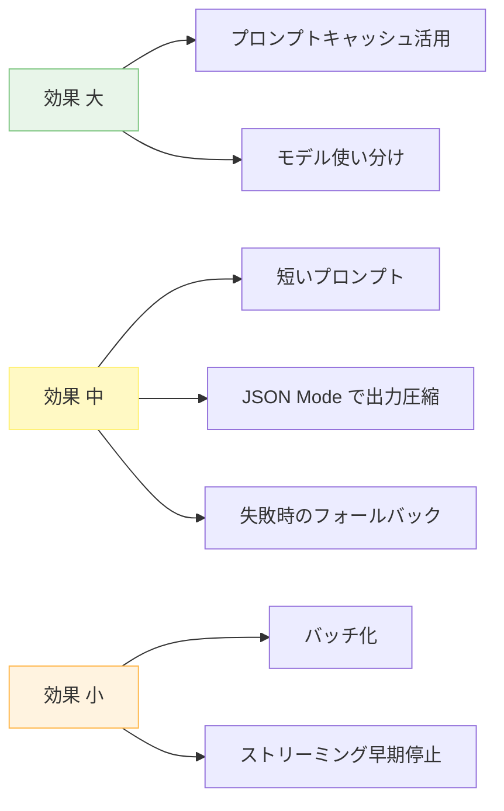
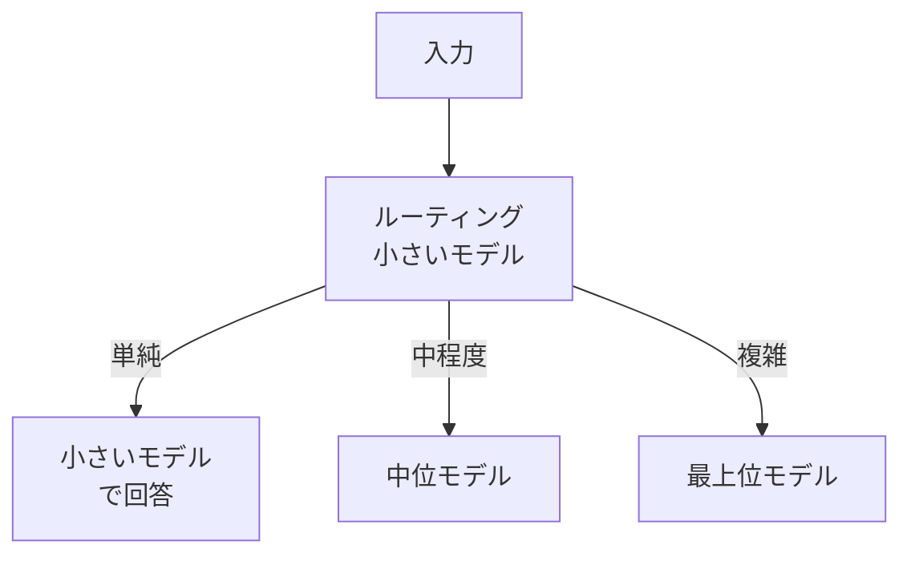
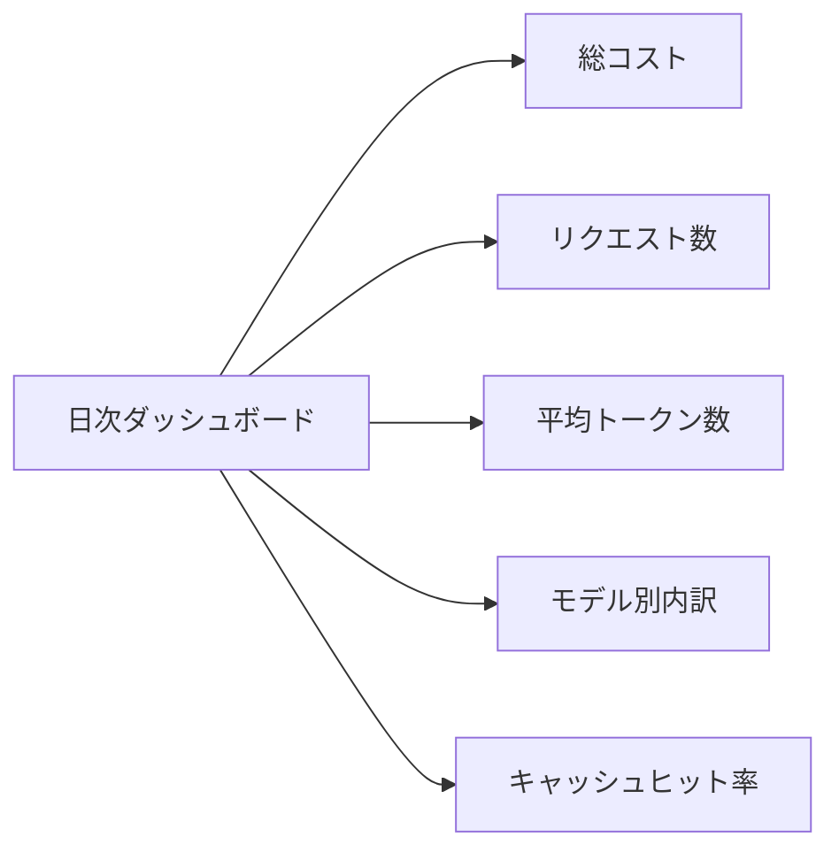

---
tags:
  - cost-optimization
  - llm
  - performance
---

# LLM コストを減らす 7 つの手法 (優先順位つき)

Techniques
#cost-optimization
#llm
#performance
updated 2026-04-13
4 min read

LLM のコストは**設計次第で 10 倍変わる**。同じ体験を 1/10 のコストで提供することは珍しくない。効果の大きい 7 つの手法を優先順位付きで紹介。

### 効果の大きさマップ

### 1. プロンプトキャッシュを活かす（効果: 最大）

ヒット時はコストが 1/2〜1/10 になる。**システムプロンプト・ツール定義・固定部分を先頭に**寄せ、変わるものは末尾に。詳しくは Techniques の「プロンプトキャッシュを壊さない書き方」を参照。

### 2. モデルを使い分ける（効果: 大）

全てを最上位モデル（gpt-4o / claude-opus）で処理するのは無駄。タスクに応じて小さいモデルを使う。

| タスク | 推奨モデル階層 |
|--------|---------------|
| ルーティング・分類 | 小さいモデル（haiku / gpt-4o-mini） |
| 要約・翻訳 | 中位モデル（sonnet / gpt-4o） |
| 複雑な推論・設計 | 最上位モデル（opus） |

### 3. プロンプトを短くする（効果: 中）

不要な敬語、冗長な指示、使われていない few-shot を削る。**500 トークン削れば、毎リクエストでコスト減**。

- システムプロンプトを定期的に棚卸し
- Few-shot は 3 件まで（それ以上は効果逓減）
- 否定形は肯定形に（文字数も減る）

### 4. JSON Mode で出力を圧縮（効果: 中）

文章で返させるより JSON で返させる方が、トークン数が少ない。**パースも楽**。

    # 長い文章出力: ~200 トークン
    # JSON 出力: ~80 トークン

### 5. フォールバックで高コスト呼び出しを減らす（効果: 中）

全てのリクエストを LLM に投げるのではなく、**ルールベースで処理できるものは LLM を呼ばない**。

- よくある質問は FAQ マッチング
- 明らかにエラーな入力は early return
- キャッシュからの返却

### 6. バッチ API を使う（効果: 小〜中）

即時性が不要な処理は、**バッチ API で 50% 割引**（OpenAI・Anthropic とも提供）。

- ユーザーインタラクションには使えない
- ログ分析・大量処理には向く

### 7. ストリーミングで早期停止（効果: 小）

ユーザーが途中で画面を閉じたとき、**アップストリームも止める**。放置すると全文まで生成される。

### 監視すべき指標

- **総コスト / 日**: 予算に対して
- **リクエスト 1 件あたりのコスト**: 設計の効率性
- **モデル別内訳**: 想定と合っているか
- **キャッシュヒット率**: 70% 以上を目指す
- **失敗率 × リトライ回数**: 無駄コストの源

### アンチパターン

- **計測なしで最適化**: どこが高いか分からないまま削る
- **全てを 1 つのモデルに集約**: 用途別の使い分けができない
- **キャッシュを無視**: タイムスタンプ等で無効化し続ける
- **早期最適化**: プロトタイプ段階で最適化して可読性を捨てる

### まとめ

コスト最適化は**プロンプトキャッシュとモデル使い分け**の 2 つで 80% が決まる。まずこの 2 つから始める。他の手法は計測結果を見て必要に応じて。

## 関連エントリ

- [LLM から構造化 JSON を確実に取り出す](llm-から構造化-json-を確実に取り出す.md)
- [LLM ツール定義のスキーマ設計](llm-ツール定義のスキーマ設計.md)
- [RAG のチャンクサイズを選ぶ基準](rag-のチャンクサイズを選ぶ基準.md)

  
← [プロンプトキャッシュを壊さない書き方](プロンプトキャッシュを壊さない書き方.md)

  
[LLM ツール定義のスキーマ設計](llm-ツール定義のスキーマ設計.md) →

