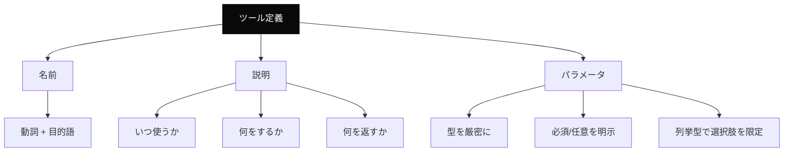
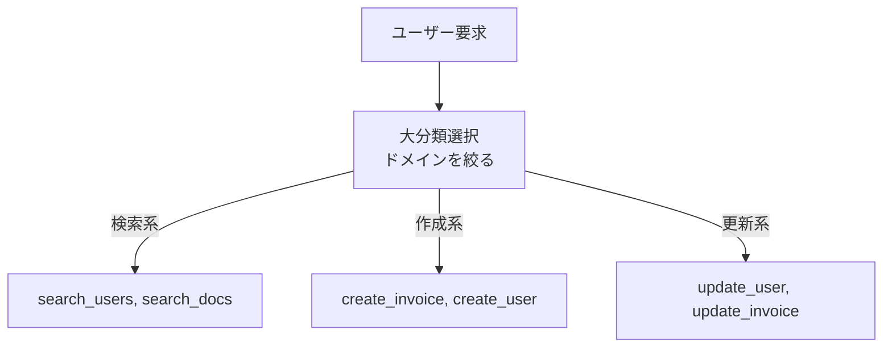

---
tags:
  - tool
  - schema
  - llm
  - technique
---

# LLM ツール定義のスキーマ設計

Techniques
#tool
#schema
#llm
#technique
updated 2026-04-13
4 min read

LLM にツール（関数）を使わせる際、**ツールのスキーマ**（名前・説明・パラメータ）が LLM の使いこなしに直結する。プロンプトエンジニアリングと同じくらい重要。

### 良いツール定義の条件

### 名前のつけ方

- **動詞 + 目的語** の形が分かりやすい（`search_documents`、`create_invoice`）
- **snake_case** で統一する
- **略語は避ける**。`usr` ではなく `user`
- **曖昧な名前は避ける**。`process_data` より `normalize_customer_names`

### 説明の書き方

説明は**使うタイミングの判断材料**になる。以下の 3 点を必ず書く。

1. **どんなときに使うツールか**（ユースケース）
2. **何をするか**（動作）
3. **何を返すか**（戻り値の形式と意味）

悪い例:

    description: "ユーザーを取得する"

良い例:

    description: "指定した ID のユーザー情報を取得する。
    ユーザーが存在しない場合は {error: 'not_found'} を返す。
    削除済みユーザーは含まれない。
    使用例: ユーザー詳細画面の表示、権限チェック。"

### パラメータの書き方

**1. 型を厳密に指定する**

    # 悪い: 型が string
    {"priority": "string"}

    # 良い: 列挙型で選択肢を限定
    {"priority": {"enum": ["high", "medium", "low"]}}

**2. 必須/任意を明示する**

必須は `required` 配列に入れる。任意なら default 値を書く。

**3. 説明をパラメータごとに書く**

    {
      "query": {
        "type": "string",
        "description": "検索キーワード。日本語・英語両方対応。空文字は不可。"
      }
    }

### アンチパターン

**1. ツールが多すぎる**

10 個以上のツールを一度に渡すと、LLM が選択ミスをする。

- **対策**: 関連ツールをグルーピングし、まず大分類を選ばせ、次に詳細ツールを渡す

**2. ツール説明が内部向け**

チームメンバー向けのドキュメントのような説明だと、LLM は使い方が分からない。**LLM 視点で「いつ・なぜ・何を」**を書く。

**3. エラー情報が不十分**

ツール実行が失敗したとき、LLM が回復できるような情報を返す。

    # 悪い
    {"error": "failed"}

    # 良い
    {
      "error": "not_found",
      "message": "ユーザー ID 123 は存在しません",
      "suggestion": "IDを確認するか、search_users で検索してください"
    }

**4. 副作用の警告なし**

削除・送信・決済等の副作用があるツールは、説明に明示する。

    description: "注文を確定する。実行すると顧客に請求メールが送信される。取り消しは refund_order で行う。"

### テスト方法

ツール定義の品質は**実際に LLM に使わせて検証**する。

    # 筆者的なタスク例を LLM に渡す
    # → どのツールを選んだか
    # → 正しい引数で呼んだか
    # → 結果をどう解釈したか
    # の 3 点を記録する

10 件のタスクで評価して、ツール選択の正答率が 80% 超えを目安にする。

### まとめ

ツールスキーマは**プロンプトの一部**として設計する。名前・説明・パラメータの 3 点を丁寧に作れば、LLM のツール使用精度は劇的に向上する。

## 関連エントリ

- [RAG のチャンクサイズを選ぶ基準](rag-のチャンクサイズを選ぶ基準.md)
- [Few-shot Examples の効果的な設計](few-shot-examples-の効果的な設計.md)
- [LLM から構造化 JSON を確実に取り出す](llm-から構造化-json-を確実に取り出す.md)

  
← [LLM コストを減らす 7 つの手法 (優先順位つき)](llm-コストを減らす-7-つの手法-優先順位つき.md)

  
[プロンプトが期待通りに動かないときのデバッグ手順](プロンプトが期待通りに動かないときのデバッグ手順.md) →

