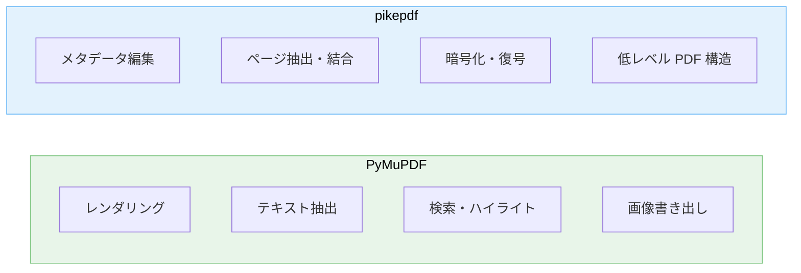

---
tags:
  - python
  - pdf
  - pymupdf
  - pikepdf
---

# Python での PDF 処理: PyMuPDF と pikepdf の使い分け

Techniques
#python
#pdf
#pymupdf
#pikepdf
updated 2026-04-13
3 min read

Python で PDF を扱う際、**PyMuPDF（fitz）** と **pikepdf** は両方とも有力だが、得意領域が異なる。両方を使い分けると実装の見通しが良くなる。

### 役割分担のマップ

### ライブラリの特徴

| 観点 | PyMuPDF | pikepdf |
|------|---------|---------|
| 基盤 | MuPDF（C++） | QPDF（C++） |
| 得意 | ビューア・テキスト抽出 | 構造的編集・圧縮 |
| ライセンス | AGPL / 商用 | MPL 2.0 |
| 速度 | レンダリングが高速 | 構造操作が堅牢 |
| 欠点 | AGPL のため配布時に注意 | レンダリング機能なし |

### 使い分けの目安

- **PDF を画面表示したい、テキストを検索したい、画像として書き出したい** → PyMuPDF
- **PDF を分割・結合したい、メタデータや注釈を編集したい、暗号化を扱いたい** → pikepdf
- **両方必要なら両方使う**。ライブラリを選ぶ時点で「一つで全て」は欲張らない

### ライセンスに関する注意

PyMuPDF は AGPL。商用製品に組み込む場合、商用ライセンスを購入するか、製品を AGPL で公開する必要がある。**配布形態を決める段階でライセンスを確認する**。開発時に気付かず AGPL を前提にした設計をすると、後で高い代償を払う。

### 実装の型

    # 読み取り・表示は PyMuPDF
    import fitz  # PyMuPDF
    doc = fitz.open("input.pdf")
    page = doc[0]
    pix = page.get_pixmap()
    pix.save("page.png")

    # 構造編集は pikepdf
    import pikepdf
    pdf = pikepdf.open("input.pdf")
    del pdf.pages[0]  # 1 ページ目を削除
    pdf.save("output.pdf")

両者は同じファイルを別プロセスで扱える。役割で切り分け、必要なときだけ相互に読み書きすればよい。

## 関連エントリ

- [AI エージェントが読みやすいドキュメントの書き方](ai-エージェントが読みやすいドキュメントの書き方.md)
- [Claude Code を日々使い倒す 10 の小技](claude-code-を日々使い倒す-10-の小技.md)
- [CoT・ToT・ReAct — 推論パターンの使い分け](cottotreact-推論パターンの使い分け.md)

  
← [RAG のチャンクサイズを選ぶ基準](rag-のチャンクサイズを選ぶ基準.md)

  

