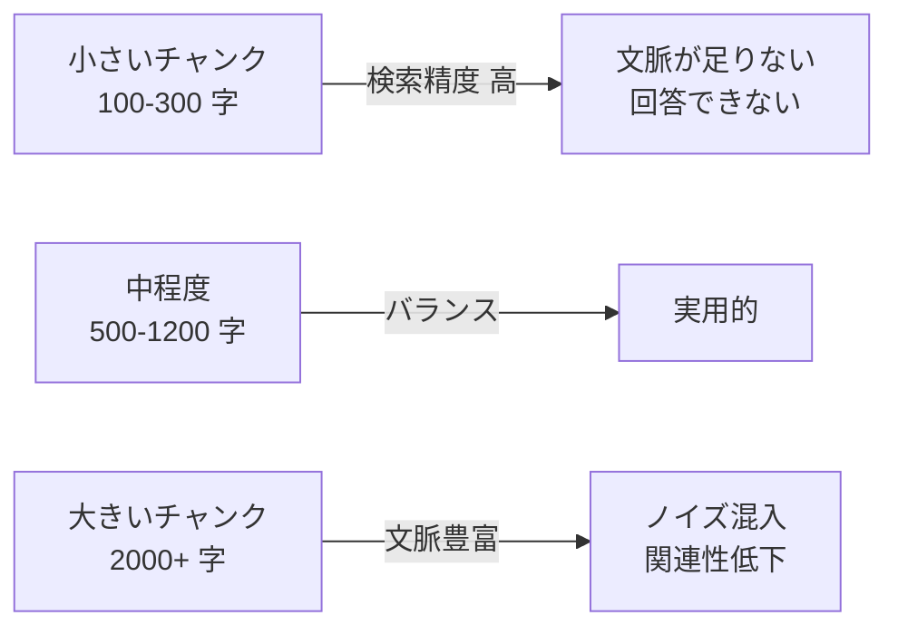
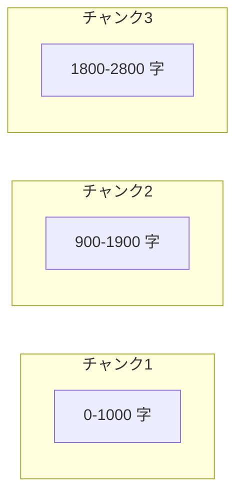

---
tags:
  - rag
  - chunking
  - llm
  - technique
---

# RAG のチャンクサイズを選ぶ基準

Techniques
#rag
#chunking
#llm
#technique
updated 2026-04-13
3 min read

RAG（Retrieval-Augmented Generation）で文書をベクトル検索用にチャンク分割する際、**チャンクサイズの選定**は検索精度と応答品質に直結する。大きすぎても小さすぎても失敗する。

### チャンクサイズの影響

**経験則**: 日本語なら **600〜1000 文字** が出発点。英語なら 200〜400 トークン。扱うドキュメントの種類で調整する。

### ドキュメント種類別の目安

| 種類 | 推奨サイズ | 理由 |
|------|-----------|------|
| FAQ・Q&A | 300-500 字 | 1 つの Q&A が 1 チャンク |
| 技術ドキュメント | 600-1000 字 | 節単位で切れる |
| 契約書・法律文書 | 400-800 字 | 条項単位。文脈欠損は致命的なので overlap 必須 |
| 論文 | 800-1500 字 | セクション内で切る |
| コード | 関数単位 | 行数ではなく意味単位 |

### オーバーラップを入れる

チャンクの境界で文脈が切れるのを防ぐため、**前後 10〜20% をオーバーラップ**させる。

100 字のオーバーラップなら、境界に跨る内容も両チャンクから引ける。

### 分割戦略

**1. 固定長分割（最もシンプル）**

    def chunk(text, size=800, overlap=100):
        chunks = []
        i = 0
        while i < len(text):
            chunks.append(text[i:i+size])
            i += size - overlap
        return chunks

手軽だが、文の途中で切れる問題あり。

**2. 句点ベース分割（日本語）**

句点・改行で区切り、サイズ上限まで結合する。自然な切れ目を保てる。

**3. 構造ベース分割**

Markdown なら見出し、HTML なら要素、コードなら関数単位で切る。最も精度が高いが実装が増える。

### 検証方法

分割後、筆者的な問い合わせを 20-30 件用意し、**どのチャンクが検索ヒットするか**を確認する。

- 期待するチャンクが上位に来るか
- 無関係なチャンクが混じらないか
- 1 回の検索で十分な文脈が揃うか

### よくある失敗

- **チャンクサイズを文字数で固定**: 日本語と英語を混在させると偏りが出る。トークン数で揃えるのが無難
- **オーバーラップを入れない**: 境界で情報が失われ、回答が不完全になる
- **メタデータを捨てる**: どのドキュメントの何章かの情報を残さないと、引用や出典が示せない

### まとめ

チャンクサイズは **600〜1000 字、オーバーラップ 10-20%** を出発点にし、**実データで検証して調整**する。最初から完璧を狙わず、ログを見て育てる。

## 関連エントリ

- [LLM ツール定義のスキーマ設計](llm-ツール定義のスキーマ設計.md)
- [AI エージェントが読みやすいドキュメントの書き方](ai-エージェントが読みやすいドキュメントの書き方.md)
- [Few-shot Examples の効果的な設計](few-shot-examples-の効果的な設計.md)

  
← [LLM-as-Judge — 評価者 LLM の組み立て方](llm-as-judge-評価者-llm-の組み立て方.md)

  
[Python での PDF 処理: PyMuPDF と pikepdf の使い分け](python-での-pdf-処理-pymupdf-と-pikepdf-の使い分け.md) →

