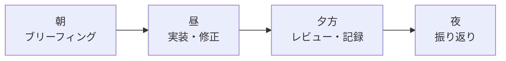
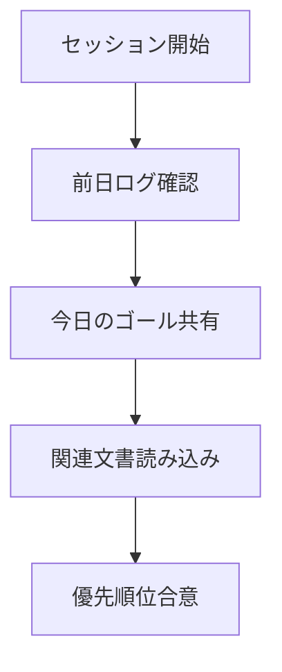
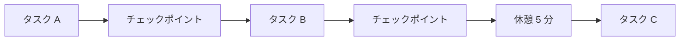
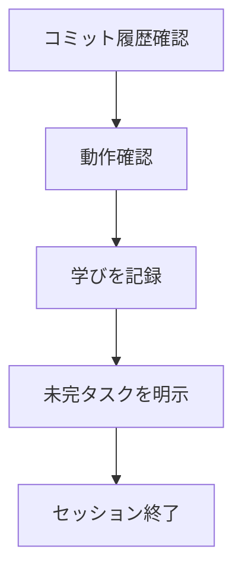
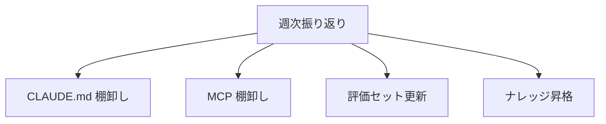

---
tags:
  - workflow
  - daily
  - agent-collaboration
---

# エージェントと協業する 1 日のワークフロー

Techniques
#workflow
#daily
#agent-collaboration
updated 2026-04-13
5 min read

AI エージェントと日常的に協業する開発者の、**典型的な 1 日の流れ**。実践的にエージェントをどう使いこなすかを時系列で示す。

### 1 日の流れ（俯瞰）

### 朝: ブリーフィング (30 分)

**目的**: 今日やることを明確化し、エージェントにコンテキストを共有する。

- 前日のセッションログをざっと確認
- 今日のゴール（1〜3 個）を Claude に共有
- 関連する ADR・ドキュメントを先に読ませる
- 優先順位を合意

**やること例**:

    今日のゴール:
    1. ユーザー認証画面の改修（高）
    2. テスト追加（中）
    3. ログ整理（低）

    関連 ADR:
    - docs/decisions/007-auth.md

    制約:
    - main ブランチに直接コミットしない
    - 既存のテストが通ることを維持

### 昼: 実装・修正 (集中時間)

**1 タスク 30〜60 分で区切る**。長く続けるとエージェントも自分も疲弊する。

**各タスクの進め方**:

1. 目的を明確化
2. エージェントにアプローチを提案させる
3. 承認してから実装着手
4. 実装 → テスト実行 → コミット
5. チェックポイント（進捗要約 + ファイル保存）

**ハマったら**:

- 15 分考えて進まなければ、**仮説を複数出して検証**
- 30 分ハマったら、別アプローチに切り替える
- 1 時間超えたら一度中断してブレイク

### 夕方: レビュー・記録 (30 分)

**目的**: その日の成果を定着させ、翌日スムーズに再開できる状態にする。

- 全コミットを git log で見直し
- 動作確認（手動 or 自動）
- **学びを記録**: 新しく分かったこと、ハマったことを `docs/dev-log.md` 等に書く
- 未完タスクの状態を明示的に書き出す

**記録例**:

    ## 2026-04-14 の学び
    - 認証まわりで、Supabase の RLS と Prisma の併用パターンを整理
    - Stripe Webhook の raw body 取得に request.text() が必要と判明
    - 次回: Webhook テストを E2E に追加

### 夜: 振り返り (15 分、週次でもよい)

**週 1 でいい**。

- CLAUDE.md の見直し（肥大化していないか）
- MCP の棚卸し（使ってないものは無効化）
- 評価セットの更新（本番で見つかった failure を追加）
- 今週の学びをナレッジベースに昇格

### タスク別のエージェント使い分け

| タスク | 推奨エージェント設定 | 自律度 |
|-------|------------------|-------|
| 小さなバグ修正 | メイン 1 つ、自動実行 | L3 |
| 新機能実装 | メイン + サブ（レビュアー） | L2 |
| 大規模リファクタリング | メイン + サブ（複数） | L2 |
| ドキュメント執筆 | メイン 1 つ、提案のみ | L1 |
| コードレビュー | code-reviewer サブエージェント | L3 |
| セキュリティ監査 | security サブエージェント | L3 |

### アンチパターン

- **目的を共有せずに実装開始**: エージェントは方向を見失う
- **チェックポイントなしで 2 時間走る**: 事故時に作業が全部消える
- **学びを記録しない**: 翌週同じ失敗を繰り返す
- **週次振り返りを省く**: CLAUDE.md が膨らみ続け、いつの間にか指示無視が増える

### 効果

この流れを 1 ヶ月続けた結果:

- 開発速度: 体感 1.5〜2 倍
- バグ発生率: 体感 半減
- 同じ失敗の繰り返し: ほぼゼロ
- 「今日何やったか分からない」感: 解消

### まとめ

エージェントと協業する日常は、**朝のブリーフィング → 昼の集中 → 夕方の記録 → 週次振り返り**のリズムで回す。これを習慣化すると、AI の恩恵を最大化しつつ、事故を抑えられる。

## 関連エントリ

- [Claude Code を日々使い倒す 10 の小技](claude-code-を日々使い倒す-10-の小技.md)
- [AI 開発の速度と品質は両立できる](../concepts/ai-開発の速度と品質は両立できる.md)
- [Claude Code を使った効率的な不具合調査](../case-studies/claude-code-を使った効率的な不具合調査.md)

  <a class="prev" href="../claude-code-を日々使い倒す-10-の小技/">←Claude Code を日々使い倒す 10 の小技</a>
  <a class="next" href="../エージェント専用ワークスペースのディレクトリ設計/">エージェント専用ワークスペースのディレクトリ設計→</a>

