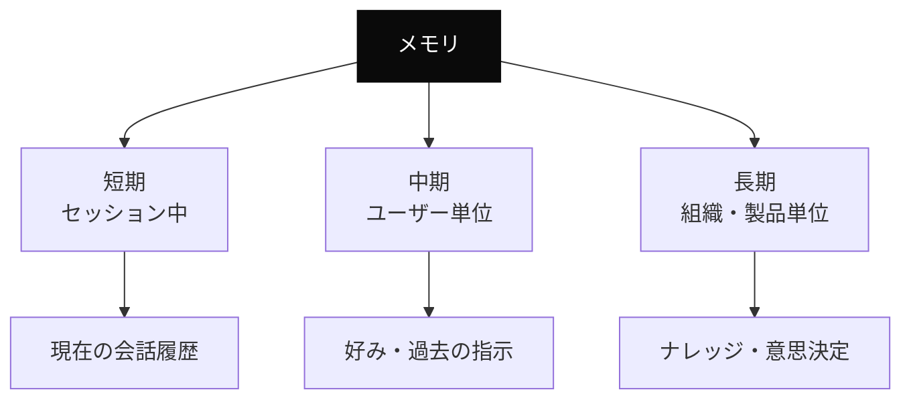
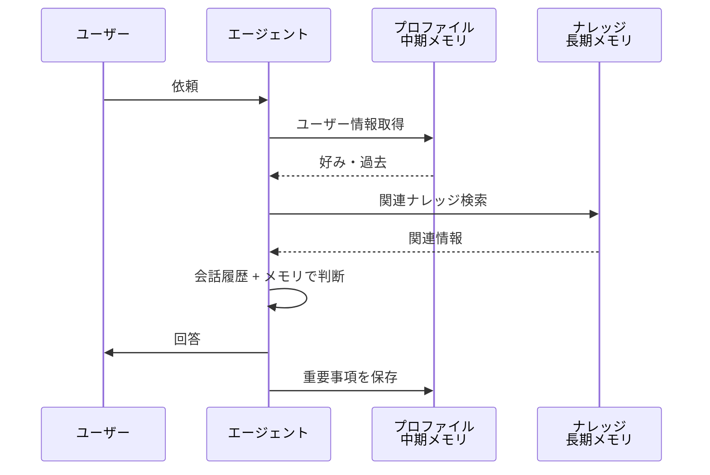

---
tags:
  - memory
  - agent-design
  - technique
---

# エージェントのメモリ設計 (短期・中期・長期)

<div class="dnk-meta" markdown>
<span class="pill cat">Techniques</span>
<span class="pill">#memory</span>
<span class="pill">#agent-design</span>
<span class="pill">#technique</span>
<span class="pill">updated 2026-04-13</span>
<span class="pill">4 min read</span>
</div>

エージェントに「記憶」を持たせる設計は、セッションをまたいだ継続的な会話・学習・作業を実現するために必須。**どこに・何を・どう保持するか**を整理する。

### メモリの 3 種類



### 短期メモリ（セッション中）

**保存場所**: セッション内の会話履歴
**消える条件**: セッション終了、コンテキスト圧縮

**設計ポイント**:

- 圧縮に耐える形式で保持する
- 重要事項は早めに外部（MEMORY.md 等）に書き出す

### 中期メモリ（ユーザー単位）

**保存場所**: ユーザープロファイル DB、外部ファイル、ベクトル DB
**消える条件**: 明示的に削除するまで

**保存すべき内容**:

- ユーザーの好み（口調、詳細度の要望）
- 過去の依頼パターン
- 解決済みの問題と解法
- 避けるべき振る舞い（フィードバックで指摘された点）

**保存しないほうがいいもの**:

- センシティブな個人情報
- 特定セッション限定の一時データ
- 量が多すぎて参照コストが上回るもの

### 長期メモリ（組織・製品単位）

**保存場所**: ナレッジベース（このような Wiki、ドキュメント DB）
**消える条件**: 削除するまで永続

**保存すべき内容**:

- 意思決定の経緯（ADR）
- 失敗と学び
- 技術選定の理由
- 運用ルール

### メモリの参照フロー



### 設計の原則

**1. 書き込みは明示的に**

エージェントが勝手にメモリに書くと、不要な情報が蓄積する。**「これをメモリに残す」は明示的なステップ**にする。

**2. 参照前にフィルタする**

全メモリを毎回読ませると、コンテキストが膨張する。**関連度の高いものだけ**を抽出して渡す。

**3. 更新可能にする**

「以前こう言っていたが、今は違う」をユーザーが伝えられる経路を用意する。メモリの上書き・削除手段を提供する。

**4. 透明性を保つ**

エージェントが何を覚えているか、ユーザーが見られるようにする。プライバシーの観点でも重要。

### アンチパターン

**1. 何でも覚える**

全てを記憶すると、プライバシー問題とコンテキスト膨張を同時に抱える。**明示的に選ぶ**。

**2. 消せないメモリ**

一度書いたら消せない設計は、誤情報が残り続ける。**削除・更新の経路**は必ず用意。

**3. メモリと会話履歴の区別がない**

会話履歴とメモリを混同すると、永続化の境界が曖昧になる。**責務を分ける**。

**4. 検索なしで全読み**

100 件のメモリを毎回全部読ませるのは無駄。**関連度で絞り込む**仕組み（ベクトル検索や tag フィルタ）を挟む。

### 実装パターン例

```
ユーザー依頼
  ↓
エージェント
  ├─ ユーザープロファイル DB から好みを取得
  ├─ ベクトル DB で関連ナレッジを検索
  └─ 会話履歴と合わせて推論
  ↓
回答
  ↓
（必要なら）重要事項をプロファイル DB に保存
```

### チェックリスト

- [ ] メモリを 3 階層（短期・中期・長期）に分けて設計した
- [ ] 保存場所と消える条件が明確
- [ ] 書き込みは明示的な判断を経る
- [ ] 関連度フィルタで参照コストを抑えている
- [ ] ユーザーがメモリ内容を確認・削除できる
- [ ] センシティブ情報は長期に残していない

### まとめ

エージェントのメモリは**「記憶」ではなく「情報アーキテクチャ」**。何を・どこに・どう保持するかを設計しないと、情報漏洩・コンテキスト膨張・品質劣化を招く。**短期・中期・長期の 3 層**で整理するのが出発点。


## 関連エントリ

- [Few-shot Examples の効果的な設計](few-shot-examples-の効果的な設計.md)
- [LLM ツール定義のスキーマ設計](llm-ツール定義のスキーマ設計.md)
- [LLM-as-Judge — 評価者 LLM の組み立て方](llm-as-judge-評価者-llm-の組み立て方.md)


<div class="dnk-prev-next" markdown>
  <div class="prev">← [LLM レッドチーミング — 意図的な攻撃で安全性を検証する](llm-レッドチーミング-意図的な攻撃で安全性を検証する.md)</div>
  <div class="next">[Claude Code を日々使い倒す 10 の小技](claude-code-を日々使い倒す-10-の小技.md) →</div>
</div>
