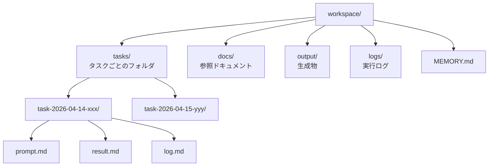
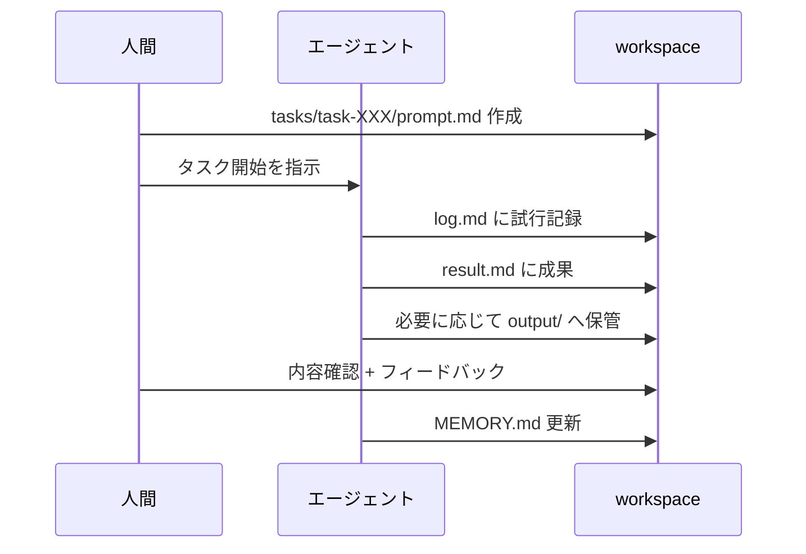

---
tags:
  - workspace
  - organization
  - directory
---

# エージェント専用ワークスペースのディレクトリ設計

Techniques
#workspace
#organization
#directory
updated 2026-04-13
5 min read

エージェントに仕事を任せる際、**作業する専用のディレクトリ構造**を設計すると、混乱が減り、追跡性が上がる。「ワークスペース」という発想で整理する。

### 基本構造

### 各ディレクトリの役割

**tasks/** — 1 タスク 1 フォルダ

- **prompt.md**: エージェントへの指示（何をしてほしいか）
- **result.md**: 成果物
- **log.md**: 試行錯誤の経緯
- **diffs/**: 生成された変更

**docs/** — エージェントが参照すべきドキュメント

- 関連する ADR
- コーディング規約
- タスクの背景情報

**output/** — 長期保管する生成物

- コード、ドキュメント、画像 等
- 完成版のみを置く（試行は tasks/ に残す）

**logs/** — 実行ログ

- 各タスクの実行結果サマリ
- エラー・失敗の記録

**MEMORY.md** — エージェントが参照する外部記憶

- セッションをまたいで保持したい決定
- よくある質問と回答
- 避けるべき振る舞い

### なぜこの構造か

**1. 追跡性**

「この変更は誰が何のために作ったか」を後から追える。

**2. 再現性**

同じタスクを再実行したいとき、prompt.md と docs/ があればほぼ再現できる。

**3. 引き継ぎ**

別のエージェントや人間が途中から引き継ぐとき、workspace を見れば状況が掴める。

**4. 失敗から学ぶ**

log.md に試行錯誤を残すと、同じ罠を踏まずに済む。

### 運用のフロー

### タスクディレクトリの命名

    tasks/
      2026-04-14-auth-refactor/
      2026-04-14-add-logging/
      2026-04-15-bug-investigation/

**日付 + kebab-case タスク名**。時系列で並ぶので追いやすい。

### 避けるべきパターン

**1. ファイルが散乱する**

ルートに `notes.md`, `old.md`, `tmp.md` が増える。**必ず tasks/ 配下**に入れる。

**2. ドキュメントが古い**

docs/ が更新されないまま放置。**参照する前に最新化**するか、日付を書く。

**3. ログが巨大化**

log.md が 1000 行超え。**タスク完了時に要約**して、詳細はアーカイブへ。

**4. MEMORY.md の肥大化**

何でも書いて膨らむ。**決定事項のみ**に絞り、詳細は ADR へ。

### スケーラビリティ

タスクが増えたら:

- **週次アーカイブ**: `tasks/archive/2026-W15/` へ移動
- **月次棚卸し**: 古いタスクの成果物を `output/` に昇格、ログを削除
- **検索**: ripgrep 等で横断検索

### 運用のコツ

- **prompt.md は必ず先に書く**。口頭指示だけで始めない
- **result.md で完了を明示**。未完なら「未完」と記載
- **週次で MEMORY.md を棚卸し**。古い決定は削除 or ADR 化

### チェックリスト

- [ ] workspace/ 直下に tasks/, docs/, output/, logs/, MEMORY.md がある
- [ ] タスクは日付 + 名前のフォルダに分ける
- [ ] prompt.md を必ず書く
- [ ] 完了したら result.md でまとめる
- [ ] 学びは MEMORY.md に反映
- [ ] 週次でアーカイブ・棚卸し

### まとめ

エージェント専用のワークスペース設計は、**追跡性・再現性・引き継ぎ**を劇的に改善する。1 タスク 1 フォルダの原則を守るだけで、混乱がなくなる。

## 関連エントリ

- [マルチエージェント組織の4つの設計教訓](マルチエージェント組織の4つの設計教訓.md)
- [AI エージェントが読みやすいドキュメントの書き方](ai-エージェントが読みやすいドキュメントの書き方.md)
- [Claude Code を日々使い倒す 10 の小技](claude-code-を日々使い倒す-10-の小技.md)

  <a class="prev" href="../エージェントと協業する-1-日のワークフロー/">←エージェントと協業する 1 日のワークフロー</a>
  <a class="next" href="../ヒアリングテンプレートの設計/">ヒアリングテンプレートの設計→</a>

