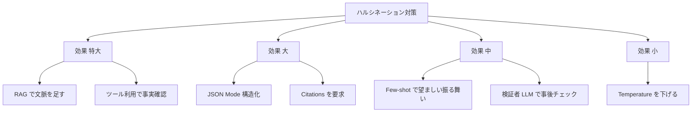
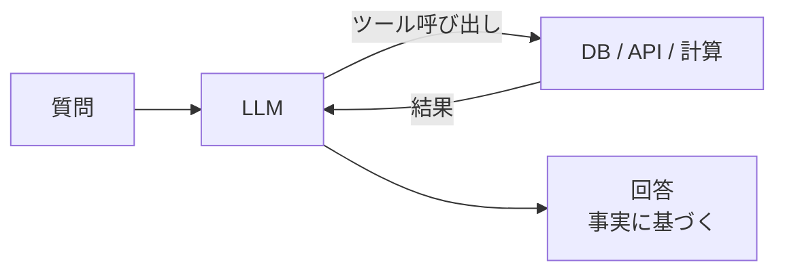
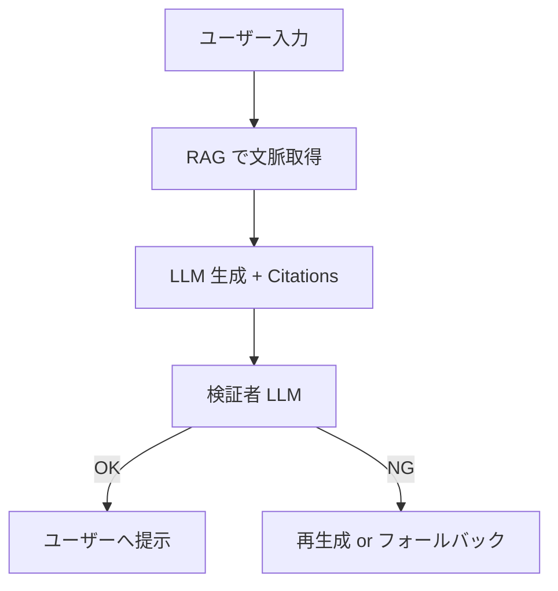

---
tags:
  - hallucination
  - rag
  - reliability
---

# ハルシネーションを抑える 7 つの手法

Techniques
#hallucination
#rag
#reliability
updated 2026-04-13
5 min read

LLM のハルシネーション（事実に基づかない生成）を完全に防ぐことはできないが、**運用上許容できるレベルまで抑える**ことは可能。7 つの手法を効果順に紹介。

### 効果の優先度

### 1. RAG で文脈を足す（効果: 特大）

LLM の学習データ外の事実は、**コンテキストに含めない限り正しく答えられない**。関連する文書を検索して LLM に渡す（RAG）。

- 社内ドキュメント、製品情報、最新データ等、全て RAG で渡す
- チャンク設計が重要（Techniques「RAG のチャンクサイズを選ぶ基準」参照）

### 2. ツール利用で事実確認（効果: 特大）

生成の途中で、LLM に**ツールを呼び出して事実を確認**させる。

- DB クエリで実データを取得
- 検索 API で最新情報を取得
- 計算を LLM に任せず、電卓ツールを呼ぶ

### 3. JSON Mode で構造化（効果: 大）

文章で返させると装飾的な嘘が混ざりやすい。**JSON で厳密に項目を埋めさせる**ほうが、嘘の余地が減る。

    # 悪い: 自由記述
    「担当者は山田さんで、たぶん 3 月頃に対応したと思います」

    # 良い: JSON
    {"person": "unknown", "date": "unknown", "notes": "情報不足"}

不明を `"unknown"` として明示させる設計にする。

### 4. Citations を要求する（効果: 大）

回答に**出典・引用**を必ず付けさせる。出典が出せないなら「情報なし」と答えさせる。

    あなたの回答には、参照した文書の ID と該当箇所を必ず添えてください。
    参照元がない情報は回答に含めないでください。

### 5. Few-shot で望ましい振る舞いを示す（効果: 中）

「情報がないときはこう答える」という例を few-shot で示す。

    例 3:
    入力: 今月の売上は?
    出典: （売上データなし）
    出力: {"answer": null, "reason": "売上データが参照できません"}

### 6. 検証者 LLM で事後チェック（効果: 中）

生成された回答を、別の LLM が「事実に基づいているか」チェックする。**整合性の低い回答を再生成させる**。

- コスト増につながる
- クリティカルな用途に限定

### 7. Temperature を下げる（効果: 小）

Temperature=0 にすると決定的に近い振る舞いになる。ハルシネーションの頻度はやや下がる。ただし**根本対策にはならない**。創造性が必要な用途では下げない。

### 層の組み合わせ

単一の対策ではなく、**複数層で守る**。用途に応じて層を足し引きする。

### 防げないハルシネーションへの備え

完璧な対策は不可能。**残ったハルシネーションを想定して**設計する。

- **UI で警告を出す**: 「AI の生成結果です。重要な判断には確認をお願いします」
- **重要なアクションは人間承認を必須に**: メール送信、決済、データ削除等
- **監視**: 出力をサンプリングして定期的に人間がチェック
- **ユーザーからのフィードバック経路**: 誤情報を報告できる仕組み

### まとめ

ハルシネーションは**消せない前提**で、**RAG + ツール利用 + 構造化**の 3 点を軸に対策を組む。完璧を目指さず、**運用で補う**設計にする。

### 関連

- RAG のチャンクサイズを選ぶ基準（Techniques）
- LLM の非決定性を前提に設計する（Concepts）
- Eval-Driven Development（Concepts）

## 関連エントリ

- [RAG のチャンクサイズを選ぶ基準](rag-のチャンクサイズを選ぶ基準.md)
- [ファインチューニング vs プロンプト — どちらを選ぶか](../concepts/ファインチューニング-vs-プロンプト-どちらを選ぶか.md)
- [AI エージェントが読みやすいドキュメントの書き方](ai-エージェントが読みやすいドキュメントの書き方.md)

  
← [プロンプトが期待通りに動かないときのデバッグ手順](プロンプトが期待通りに動かないときのデバッグ手順.md)

  
[LLM レッドチーミング — 意図的な攻撃で安全性を検証する](llm-レッドチーミング-意図的な攻撃で安全性を検証する.md) →

