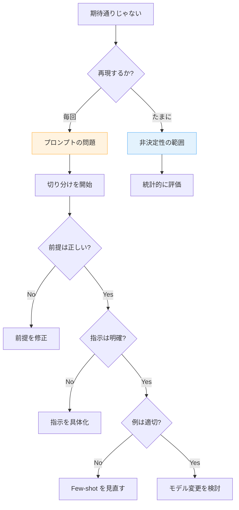

---
tags:
  - prompt-debug
  - troubleshooting
  - llm
---

# プロンプトが期待通りに動かないときのデバッグ手順

Techniques
#prompt-debug
#troubleshooting
#llm
updated 2026-04-13
4 min read

LLM が期待通りの出力を返さないとき、何から手をつけるか。**プロンプトデバッグ**はアプリ開発と違った進め方が必要。

### 切り分けの手順

### 1. 再現性を確認する

**同じ入力で 5 回実行し、パターンを見る**。

- 全て同じように失敗する → プロンプトの問題（決定的バグ）
- 半分成功・半分失敗 → 非決定性の範囲（統計的対応が必要）
- たまに失敗 → モデルの揺らぎ（許容範囲の場合あり）

### 2. 最小限のプロンプトで再現する

長いプロンプトの中で失敗している場合、**削りながら再現する**。

- ユーザー入力を最小化
- Few-shot を 1 件だけに
- システムプロンプトを短縮

どこまで削っても失敗する → そこに原因がある。

### 3. 失敗のパターンを分類する

- **形式の失敗**: JSON が壊れる、フォーマットが崩れる
- **内容の失敗**: 事実誤認、関連性が低い
- **指示の失敗**: 禁止した行動を取る、指示を無視する
- **意図の失敗**: やりたいことと違うことをする

パターン別に対処が異なる。

### 4. 対処法のマトリクス

| 失敗 | 第一手 | 効かなければ |
|------|--------|-------------|
| 形式の失敗 | JSON Mode / Function Calling | 手動パース + リトライ |
| 内容の失敗 | RAG で文脈を足す | ツールで事実確認 |
| 指示の失敗 | 肯定形に書き換え | モデルを変える |
| 意図の失敗 | Few-shot で具体例 | ヒアリングをやり直す |

### 5. デバッグ用の出力を引き出す

LLM に「なぜその答えを選んだか」を説明させる。

    あなたの判断根拠を、最終回答の前に書いてください。
    形式:
      推論: <ステップバイステップの考察>
      最終回答: <ユーザー向け回答>

推論部分を読むと、どこで解釈を間違えたかが見える。

### 6. プロンプトの差分をログに取る

プロンプトを書き換えたとき、**前後で評価セットのスコアを比較**する。

- 評価セット全体で平均が上がっているか
- 特定の入力だけ改善して他は悪化していないか
- 回帰はないか

1 件の成功で判断しない。

### アンチパターン

**1. 一度に複数箇所を変える**

プロンプトを 3 箇所変えたら、どの変更が効いたか分からない。**1 箇所ずつ変える**。

**2. 失敗例を残さない**

「あっ、これ直った」と喜んで忘れる。後で同じ失敗が出ても気づけない。**評価セットに追加する**。

**3. 指示を盛り続ける**

「こうしてください」「ああしてください」と追加するうち、プロンプトが 200 行に。**削る勇気**が必要。

**4. モデル変更に走りすぎる**

プロンプトの工夫で解決できる問題を、モデル変更で解決しようとする。**最後の手段**にする。

### チェックリスト

- [ ] 同じ入力で 5 回実行してパターンを見た
- [ ] 最小限のプロンプトで再現した
- [ ] 失敗をカテゴリ分類した
- [ ] 1 箇所ずつ変更している
- [ ] 評価セットで回帰を確認している
- [ ] 失敗例を評価セットに追加した

### まとめ

LLM のデバッグは**統計的**であり、**非決定性を前提**にする必要がある。再現性の確認・最小化・分類・1 箇所ずつ改善、の 4 ステップを守ると確実に前進できる。

## 関連エントリ

- [LLM から構造化 JSON を確実に取り出す](llm-から構造化-json-を確実に取り出す.md)
- [LLM コストを減らす 7 つの手法 (優先順位つき)](llm-コストを減らす-7-つの手法-優先順位つき.md)
- [LLM ツール定義のスキーマ設計](llm-ツール定義のスキーマ設計.md)

  
← [LLM ツール定義のスキーマ設計](llm-ツール定義のスキーマ設計.md)

  
[ハルシネーションを抑える 7 つの手法](ハルシネーションを抑える-7-つの手法.md) →

