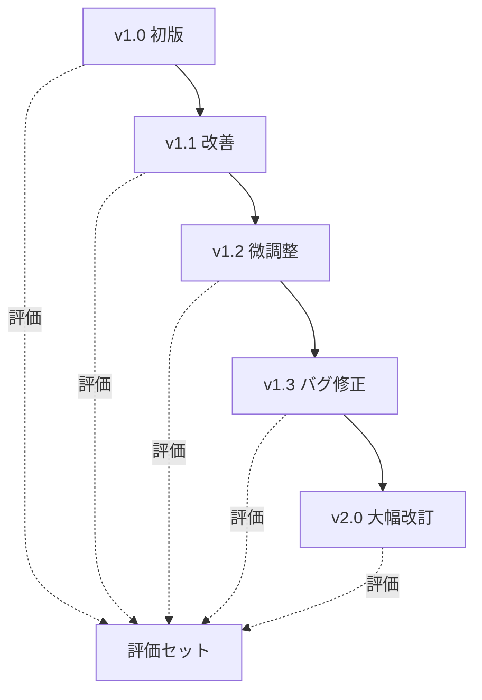
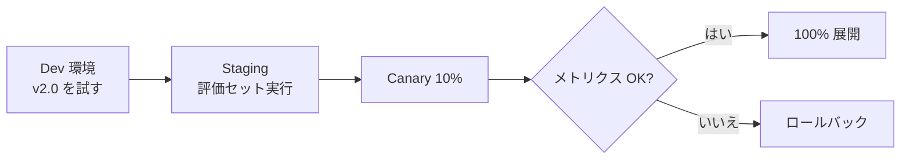

---
tags:
  - versioning
  - prompt
  - deployment
---

# プロンプトのバージョン管理とデプロイ戦略

<div class="dnk-meta" markdown>
<span class="pill cat">Techniques</span>
<span class="pill">#versioning</span>
<span class="pill">#prompt</span>
<span class="pill">#deployment</span>
<span class="pill">updated 2026-04-13</span>
<span class="pill">4 min read</span>
</div>

プロンプトはコード同様に**バージョン管理**の対象。Git で管理するだけでは不十分で、**評価・差分・ロールバック**の仕組みが要る。

### バージョン管理の基本構造



### やるべきこと

**1. ファイル分離**

プロンプトを**コードから分離**し、専用のディレクトリに置く。

    prompts/
      chat/
        v1/
          system.md
          few_shot_1.md
        v2/
          system.md
        active.md  →  v2/system.md のシンボリックリンク

**2. 意味のあるバージョン番号**

セマンティックバージョニングを準用する。

- Patch: 誤字修正・言い回し調整（挙動がほぼ変わらない）
- Minor: 新機能や few-shot 追加（互換性あり）
- Major: 構造変更（互換性なし、再評価必須）

**3. 評価セットを紐付ける**

各バージョンで**評価セットを実行してスコアを残す**。バージョンごとに履歴が追える。

```
v1.0 → score: 72
v1.1 → score: 78（+6）
v1.2 → score: 76（-2）← 回帰、注意
v1.3 → score: 81（+5）
```

**4. 差分をレビュー**

プロンプト変更は**コードレビューと同じ扱い**にする。Pull Request で差分を見て、変更理由を説明する。

**5. ロールバック手段**

新バージョンで問題が出たら、**すぐに前バージョンに戻せる**手段を用意する。

### デプロイ戦略



- Dev: 新バージョンを試す、小規模評価
- Staging: 完全な評価セットを流す、合格ラインを確認
- Canary: 10% のユーザーに新バージョンを配信、メトリクス監視
- Full: 問題なければ 100% へ

### アンチパターン

**1. プロンプトをコードに直書き**

    response = openai.complete(
      "あなたはアシスタントです。以下の質問に..."  # ← ハードコード
    )

バージョン管理できない。必ずファイルに分離する。

**2. バージョンを付けない**

何を変えたか追跡できない。評価スコアとの紐付けができない。

**3. 評価なしで本番投入**

「改善したつもり」で回帰しているケースがある。評価セットで確認しない限り進めない。

**4. ロールバック手段なし**

ダメだったときに戻せないと、事故のダメージが長引く。

### チェックリスト

- [ ] プロンプトがファイルに分離されている
- [ ] バージョン番号が付いている
- [ ] 各バージョンで評価セットスコアが残る
- [ ] 変更は PR レビューを経ている
- [ ] ロールバック手順が文書化されている
- [ ] Canary デプロイで本番検証している

### メタデータとして残すべき情報

    # プロンプト v2.1
    - 作成日: 2026-04-14
    - 作成者: xxx
    - 変更理由: few-shot を 3 件から 5 件に増やし、エッジケース対応
    - 評価スコア: 83（前: 78、+5）
    - 前バージョン: v2.0

### まとめ

プロンプトはコードと同じく**バージョン管理・評価・デプロイの 3 点を仕組み化**する。場当たり的な変更を許すと、改善が再現できなくなる。


## 関連エントリ

- [ファインチューニング vs プロンプト — どちらを選ぶか](../concepts/ファインチューニング-vs-プロンプト-どちらを選ぶか.md)
- [AI エージェントが読みやすいドキュメントの書き方](ai-エージェントが読みやすいドキュメントの書き方.md)
- [Claude Code を日々使い倒す 10 の小技](claude-code-を日々使い倒す-10-の小技.md)


<div class="dnk-prev-next" markdown>
  <div class="prev">← [プロンプトキャッシュを壊さない書き方](プロンプトキャッシュを壊さない書き方.md)</div>
  <div class="next">[LLM コストを減らす 7 つの手法 (優先順位つき)](llm-コストを減らす-7-つの手法-優先順位つき.md) →</div>
</div>
