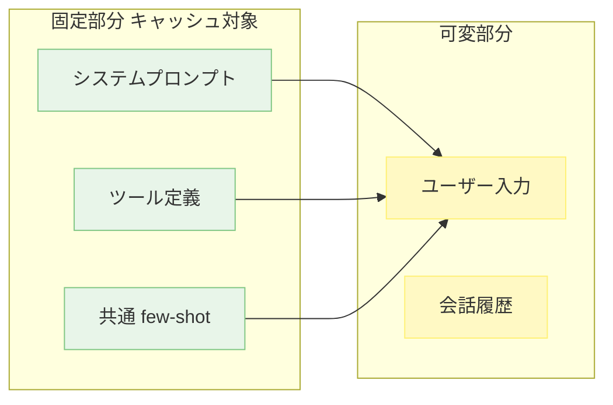

---
tags:
  - prompt-cache
  - llm
  - optimization
---

# プロンプトキャッシュを壊さない書き方

Techniques
#prompt-cache
#llm
#optimization
updated 2026-04-13
3 min read

LLM API の多くは同じ先頭プロンプトを再利用することで**プロンプトキャッシュ**を効かせ、レイテンシとコストを劇的に下げられる。ただしキャッシュは「先頭から完全一致」が前提なので、わずかな変動で無効化される。

### キャッシュが効く構造

固定部分を先頭に、可変部分を末尾に配置する。固定部分の内容が全く同じなら、そのリクエスト群ではキャッシュが効く。

### 壊す原因トップ 5

**1. タイムスタンプをシステムプロンプトに入れる**

`現在時刻: 2026-04-14 10:35` のような行がプロンプトに入ると、毎リクエストで無効化される。

- **対策**: タイムスタンプはユーザーメッセージ側に。どうしてもシステム側に置きたいなら、ハーネスに固定位置で注入させる

**2. ランダムな ID・セッション番号を先頭に入れる**

UUID やセッション ID が先頭にあると無効化。

- **対策**: 可変 ID はメッセージの末尾、またはメタデータとして別経路で渡す

**3. プロンプトの末尾ではなく中央に可変部分を挟む**

`先頭 → 可変 → 固定` の順は、可変より後ろが全てキャッシュ外になる。

- **対策**: `固定 → 可変` の順を徹底する

**4. システムプロンプトを毎回微修正する**

改善を繰り返すのはいいが、修正するたびにキャッシュがクリアされる。

- **対策**: 改善版は新しい会話で試し、確定してから本番に反映する

**5. ツール定義の順序が毎回変わる**

ツール配列の順序が変わるだけでキャッシュは無効化される。

- **対策**: ツール配列の順序を固定する。ソート順を明示的に決める

### チェックリスト

- [ ] タイムスタンプはシステムプロンプトに入っていない
- [ ] ID やセッション番号は末尾側に寄せている
- [ ] プロンプト順序は 固定 → 可変 の一方向
- [ ] システムプロンプトを頻繁に書き換えていない
- [ ] ツール配列の順序が毎回同じ

### 効果の目安

プロバイダーによるが、キャッシュヒット時は**レイテンシ 2〜5 倍、コスト 1/2〜1/10** 程度まで改善することが多い。長いシステムプロンプトやツール定義を使うアプリほど、効果が大きい。

## 関連エントリ

- [LLM から構造化 JSON を確実に取り出す](llm-から構造化-json-を確実に取り出す.md)
- [RAG のチャンクサイズを選ぶ基準](rag-のチャンクサイズを選ぶ基準.md)
- [Eval-Driven Development — LLM 機能開発は評価から始める](../concepts/eval-driven-development-llm-機能開発は評価から始める.md)

  
← [LLM から構造化 JSON を確実に取り出す](llm-から構造化-json-を確実に取り出す.md)

  
[ヒアリングテンプレートの設計](ヒアリングテンプレートの設計.md) →

