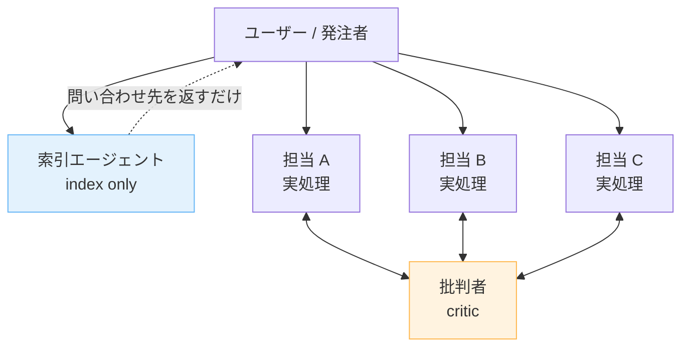

---
tags:
  - multi-agent
  - agent-design
  - organization
---

# マルチエージェント組織の4つの設計教訓

Techniques
#multi-agent
#agent-design
#organization
updated 2026-04-13
2 min read

AI エージェントを複数ロールで運用する際に得た設計上の教訓。

### 組織構造の比喩

索引エージェントは「誰に聞けばいいか」を返すだけで、実処理は担当エージェントが直接ユーザーと対話する。批判者は全担当の成果物を別軸でレビューする。

### 1. レビュー役は「対等な同僚」の口調で

上から目線でも卑屈でもなく、忌憚なく指摘する同僚のトーンを指示する。同調バイアスを避けるため、丁寧すぎる口調は有害。

### 2. 権限は文章ではなく仕組みで制限する

「〜しないでください」と指示するより、ツール権限（Edit/Bash 等）を設定レベルで剥奪する方が確実。LLM は否定命令の遵守率が低い。

### 3. 索引エージェントに処理を集中させない

全部署の報告を経由する「秘書」型エージェントを作ると、そのエージェントのコンテキストが肥大化して品質が劣化する。索引は索引に徹させ、問い合わせ先を返すだけにする。実処理は担当エージェントに直接させる。

### 4. コンテキスト量と回答品質は反比例する

セッションが長くなるほどハルシネーション・バイアスのリスクが増大する。外部記憶ファイル（MEMORY.md 等）への退避と、意図的なコンテキスト抑制が品質維持に不可欠。

## 関連エントリ

- [二役レビューの実装パターン](二役レビューの実装パターン.md)
- [マルチエージェントの8つの失敗モード](../patterns/マルチエージェントの8つの失敗モード.md)
- [LLM-as-Judge — 評価者 LLM の組み立て方](llm-as-judge-評価者-llm-の組み立て方.md)

  

  
[二役レビューの実装パターン](二役レビューの実装パターン.md) →

