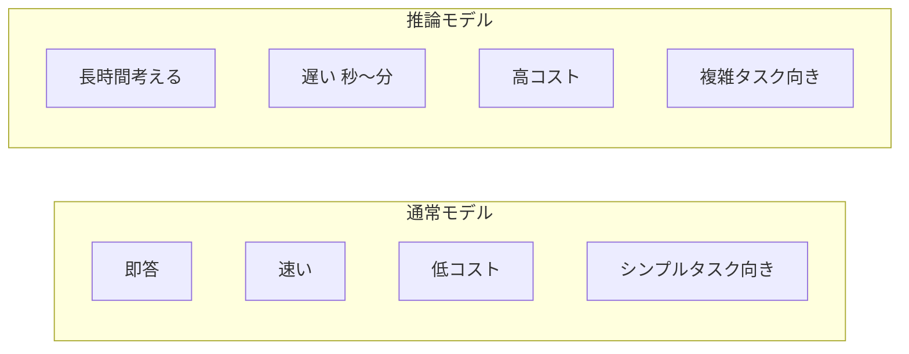
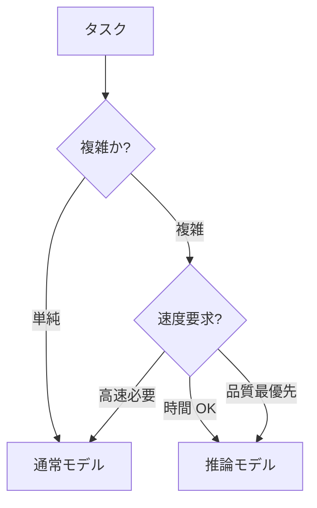
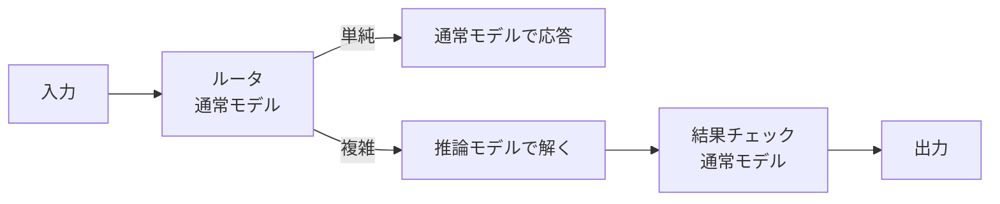

---
tags:
  - reasoning-model
  - o1
  - extended-thinking
---

# 推論モデル (o1/o3/Extended Thinking) の使いどころ

Techniques
#reasoning-model
#o1
#extended-thinking
updated 2026-04-13
4 min read

OpenAI の o1・o3、Anthropic の Extended Thinking、Google の Deep Thinking など、**明示的に推論時間を使うモデル**（Reasoning Model）が増えている。通常の LLM とは使い分けが必要。

### 通常モデル vs 推論モデル

### 推論モデルが向くタスク

**1. 多段階の論理推論**

- 数学問題
- プログラミング問題の設計
- 論理パズル

**2. 複雑な最適化**

- スケジューリング
- リソース配分
- トレードオフ分析

**3. 深い理解を要する分析**

- 法律文書の解釈
- 研究論文の批判的読解
- 複雑なコードの設計レビュー

### 向かないタスク

- 簡単な要約・翻訳
- 分類・ルーティング
- 単純な質問応答
- リアルタイム対話

**速度と柔軟性**が重要なら通常モデル。

### 使い分け判断

### コスト感

推論モデルは**出力トークンだけでなく、内部の推論トークンも課金される**。

- 出力が 500 トークンでも、内部推論で 5000 トークン使われると、その分のコスト
- 「答えは短いけど高コスト」になる

### プロンプト設計の違い

**通常モデル**: 詳細な指示・few-shot を多用

**推論モデル**: 指示は最小限で OK。LLM 自身が推論で補う

    # 通常モデル用
    以下の手順で問題を解いてください:
    1. 条件を整理する
    2. 制約を確認する
    3. 候補を挙げる
    4. 評価して最良を選ぶ
    5. 最終回答を出す

    # 推論モデル用
    この問題を解いてください。
    （手順は指示しない、モデルが自分で考える）

指示が詳細すぎると、推論モデルの自由度を奪ってしまう。

### ハイブリッド運用

- 入力の複雑度をルータで判定し、使い分ける
- 推論モデルの出力を通常モデルでチェックする二段階構成も有効

### ベンチマーク傾向

| タスク種別 | 通常モデル | 推論モデル |
|-----------|----------|-----------|
| 数学（高校レベル） | 70% | 95% |
| コーディング（中級） | 80% | 93% |
| 論理推論 | 65% | 90% |
| 要約 | 90% | 92%（差小） |
| 分類 | 95% | 95% |

**差が大きいタスク**で推論モデルを使うのが経済的。

### アンチパターン

**1. 全てに推論モデルを使う**

速度・コストが悪化する。**タスクを選んで**使う。

**2. 推論モデルに詳細指示**

推論の自由度を奪い、品質が落ちることがある。

**3. 推論時間の制限を設けない**

コストが読めなくなる。**タイムアウト**を設定する。

**4. ストリーミング前提の設計**

推論モデルは応答まで数秒〜分かかる。ユーザー体験を考慮する（「考え中...」表示等）。

### チェックリスト

- [ ] タスクの複雑度を判定した
- [ ] 通常モデルで試してから推論モデルを検討した
- [ ] 推論モデルの内部トークンコストを見積もった
- [ ] 応答時間が UX 上許容できるか確認した
- [ ] 推論モデル専用のプロンプト（指示簡潔化）に調整した

### まとめ

推論モデルは**強力だが高コスト・高レイテンシ**。複雑タスクで通常モデルが限界のときの選択肢。**ルータと組み合わせて使い分ける**のが王道。

## 関連エントリ

- [AI エージェントが読みやすいドキュメントの書き方](ai-エージェントが読みやすいドキュメントの書き方.md)
- [Claude Code を日々使い倒す 10 の小技](claude-code-を日々使い倒す-10-の小技.md)
- [CoT・ToT・ReAct — 推論パターンの使い分け](cottotreact-推論パターンの使い分け.md)

  <a class="prev" href="../cottotreact-推論パターンの使い分け/">←CoT・ToT・ReAct — 推論パターンの使い分け</a>
  <a class="next" href="../llm-から構造化-json-を確実に取り出す/">LLM から構造化 JSON を確実に取り出す→</a>

