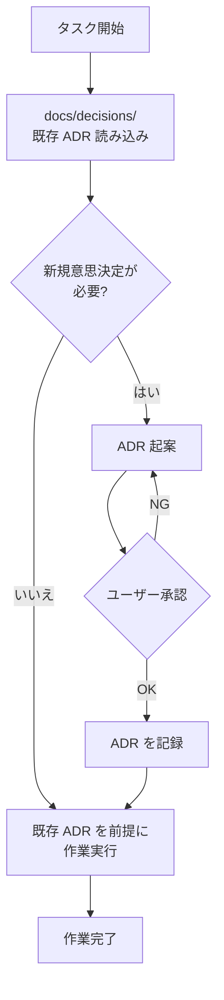
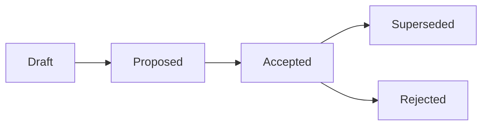

---
tags:
  - adr
  - claude-code
  - context
---

# ADR 参照コマンドによる意思決定の継承

Tools
#adr
#claude-code
#context
updated 2026-04-13
2 min read

アーキテクチャ上の意思決定を Architecture Decision Record（ADR）として残し、Claude Code の作業前に自動で参照させる運用パターン。

### ADR 参照の流れ

### コマンドの中身

ADR コマンドは次の 2 ステップで動く。

1. **既存 ADR の読み込み**: `docs/decisions/` 配下の全 ADR を作業開始前に読む
2. **新規意思決定の検出**: タスクがアーキテクチャ・製品方針・技術選定・組織変更に関わる場合、既存フォーマットに沿って新しい ADR を起案し、ユーザー承認を得てから作業を進める

### なぜ有効か

- **コンテキスト肥大化を防げる**: CLAUDE.md に過去の決定を詰め込まず、必要時に ADR を参照できる
- **意思決定の根拠が残る**: 「なぜその設計を選んだか」が後から追跡できる
- **セッション間で文脈が引き継がれる**: Claude Code が再起動しても ADR を読み直せば同じ判断基準で動ける
- **ユーザーと合意形成しやすい**: 新規決定は ADR ドラフトを先に見せるため、食い違いを早期に発見できる

### ADR のフォーマット例

    # ADR 001: <決定のタイトル>

    ## 状況
    （背景・課題）

    ## 決定
    （何を決めたか）

    ## 根拠
    （なぜその選択か）

    ## トレードオフ
    （代替案と、それを採らなかった理由）

### ADR のライフサイクル

### 運用のコツ

- ADR は追記のみ。既存 ADR を書き換えず、撤回する場合は新しい ADR で superseded を明記する
- 番号は連番。日付はタイトル末尾に括弧書きで付ける
- タスクに関連する ADR だけを読むよう、タスク指示側でスコープを絞ると効率的

## 関連エントリ

- [CLAUDE.md 肥大化を ADR 分離で回復した事例](../case-studies/claudemd-肥大化を-adr-分離で回復した事例.md)
- [Claude Code settings.json を使いこなす](claude-code-settingsjson-を使いこなす.md)
- [Claude Code のサブエージェント活用法](claude-code-のサブエージェント活用法.md)

  <a class="prev" href="../forge-ハーネス設計フレームワーク/">←forge — ハーネス設計フレームワーク</a>
  <a class="next" href="../claude-code-settingsjson-を使いこなす/">Claude Code settings.json を使いこなす→</a>

