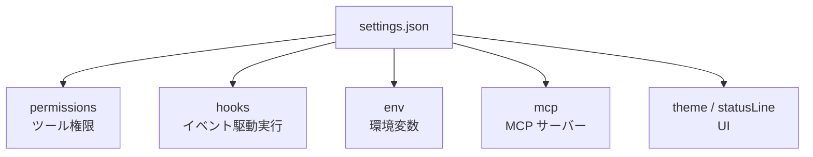
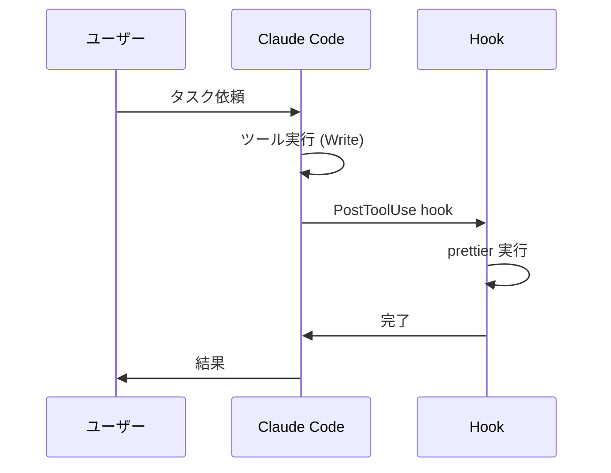

---
tags:
  - claude-code
  - settings
  - configuration
---

# Claude Code settings.json を使いこなす

Tools
#claude-code
#settings
#configuration
updated 2026-04-13
5 min read

Claude Code は `~/.claude/settings.json` でツール権限・hooks・環境変数・MCP サーバーを集中管理できる。**この 1 ファイルを使いこなせるかで、日々の運用効率が大きく変わる**。

### 管理できる主な項目

### permissions: ツール実行の許可

`allow` `deny` `ask` の 3 段階で、ツール実行の挙動を指定する。

    {
      "permissions": {
        "allow": [
          "Bash(git status)",
          "Bash(git diff*)",
          "Read(*)"
        ],
        "deny": [
          "Bash(rm -rf*)",
          "Write(/etc/**)"
        ]
      }
    }

- `allow` に入れたコマンドは確認なしで実行される
- `deny` は絶対拒否
- どちらにも入っていないと `ask`（毎回確認）

**運用のコツ**: よく使う読み取り系（`git status`、`ls`、`cat` 相当）は `allow` に入れると、確認連発から解放される。破壊的操作は `deny` に入れておく。

### hooks: イベント駆動のフック

ツール実行前後に任意のコマンドを走らせる。Git pre-commit のようなもの。

    {
      "hooks": {
        "PostToolUse": [
          {
            "matcher": "Write",
            "hooks": [
              {"type": "command", "command": "prettier --write $CLAUDE_FILE_PATHS"}
            ]
          }
        ]
      }
    }

**使い所**:

- ファイル保存時に自動フォーマット
- コミット前にテスト実行
- 特定のツール実行時にログを残す

### env: 環境変数

セッション全体に渡す環境変数を設定。

    {
      "env": {
        "CLAUDE_DEFAULT_MODEL": "claude-opus-4-6",
        "MAX_THINKING_TOKENS": "10000"
      }
    }

- モデルのデフォルトを切り替える
- API キーは `.env` ファイル側に置き、settings には書かない（コミット事故防止）

### mcp: MCP サーバー

ツール拡張の接続定義。

    {
      "mcp": {
        "servers": {
          "filesystem": {
            "command": "npx",
            "args": ["-y", "@modelcontextprotocol/server-filesystem", "/path"]
          }
        }
      }
    }

**注意**: MCP を増やすほどコンテキスト消費が増える。**6 本以下**を目安に絞る（Patterns カテゴリの「MCP 過多」参照）。

### ベストプラクティス

**1. グローバルとプロジェクトで分離**

- `~/.claude/settings.json` — グローバル設定（全プロジェクト共通）
- プロジェクト直下の `.claude/settings.json` — プロジェクト固有

プロジェクト固有の方が優先される。

**2. コミット対象を選ぶ**

プロジェクト側の `.claude/settings.json` はチーム共有が基本。ただし**秘密情報・個人環境依存**は含めない。

**3. 定期的に見直す**

hooks を書きすぎると動作が遅くなる。四半期ごとに棚卸しして、使っていないものは削る。

### よくある失敗

- **MCP を思いつきで追加し続ける** → コンテキスト肥大化
- **deny ルールに頼って `Bash` を全許可** → 許可の粒度が粗すぎて事故が起きる
- **hooks で長時間処理を走らせる** → Claude Code の応答が詰まる

### まとめ

`settings.json` は Claude Code の運用を左右する **最重要ファイル**。permissions を整えるだけで、日々のストレスが劇的に減る。hooks は慎重に。

## 関連エントリ

- [ADR 参照コマンドによる意思決定の継承](adr-参照コマンドによる意思決定の継承.md)
- [Claude Code のサブエージェント活用法](claude-code-のサブエージェント活用法.md)
- [forge — ハーネス設計フレームワーク](forge-ハーネス設計フレームワーク.md)

  
← [ADR 参照コマンドによる意思決定の継承](adr-参照コマンドによる意思決定の継承.md)

  
[Claude Code のサブエージェント活用法](claude-code-のサブエージェント活用法.md) →

