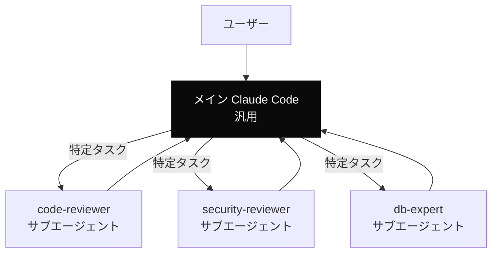
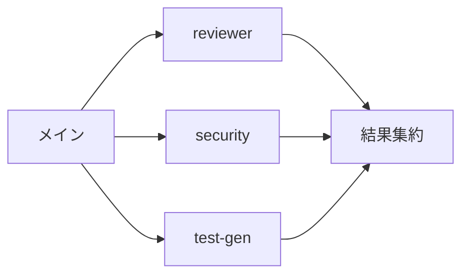

---
tags:
  - claude-code
  - sub-agent
  - orchestration
---

# Claude Code のサブエージェント活用法

Tools
#claude-code
#sub-agent
#orchestration
updated 2026-04-13
4 min read

Claude Code のサブエージェント機能は、専門分野に特化した別エージェントを呼び出す仕組み。うまく使えば**メインのコンテキストを節約**しつつ、**専門的な判断**を得られる。

### 基本構造

メインはオーケストレーター役に徹し、専門タスクは別エージェントに委譲する。

### 得られる効果

**1. コンテキストの節約**

メインのコンテキストには**サブエージェントの出力結果のみ**が入る。サブエージェント内部の長い推論はメインに残らない。

**2. 専門性の向上**

サブエージェントごとに**専用のシステムプロンプト**を持てる。セキュリティレビューなら OWASP Top 10、DB 設計なら正規化原則など、専門プロンプトで精度が上がる。

**3. 並列実行**

複数のサブエージェントを**同時に走らせられる**。レビュー・セキュリティ監査・テスト生成を並列化できる。

### 設計のコツ

**1. 1 つの責務に絞る**

サブエージェントは **1 つの仕事** に絞る。「コードレビュー + テスト生成 + デプロイ」のような複合責務は避ける。

**2. 明確な入出力契約**

- 入力: 何を渡すか（ファイルパス、コード片、要件 等）
- 出力: 何を返すか（JSON か、Markdown か、スコア付きか）

呼び出し側と認識を揃える。

**3. モデルを使い分ける**

シンプルな分類・要約は小さいモデル（Haiku 系）で十分。複雑な推論だけ上位モデルを使う。

**4. 失敗時の挙動を決める**

- タイムアウト時: デフォルト値を返すか、エラーを上げるか
- 部分成功時: どう報告するか
- リトライ: するかしないか

### アンチパターン

**1. サブエージェントを増やしすぎる**

10 個のサブエージェントを持つと、どれを使うべきか判断コストが増える。**使用頻度の高いもの 3〜5 個**に絞る。

**2. メインで済むタスクを委譲する**

軽いタスクまでサブエージェントに投げると、**起動コストの方が重い**。判断基準を決める。

- 委譲する: 専門プロンプトが活きる、コンテキストを汚染したくない、並列化したい
- 委譲しない: 単純な検索、短いテキスト処理、即座に結果が必要

**3. サブエージェントの出力をそのまま採用**

サブエージェントも LLM。**検証なしに信じない**。重要な出力は人間またはメイン側でチェックする。

**4. ログを残さない**

サブエージェント呼び出しの入出力をログしないと、何が起きたか追跡できない。

### 運用のチェック

- [ ] サブエージェントの責務は 1 つに絞られているか
- [ ] 入出力契約が明文化されているか
- [ ] サブエージェントごとにモデルを使い分けているか
- [ ] 使用頻度が低いサブエージェントは削除対象か
- [ ] 呼び出しログが残っているか

### まとめ

サブエージェントは**オーケストレーション**の手段。メインを身軽に保ち、専門的な仕事を別エージェントに任せる。設計がうまく回ると、1 つのモデル・1 つのセッションで済ませるより、**速くて安くて質が高い**結果になる。

## 関連エントリ

- [ADR 参照コマンドによる意思決定の継承](adr-参照コマンドによる意思決定の継承.md)
- [Claude Code settings.json を使いこなす](claude-code-settingsjson-を使いこなす.md)
- [forge — ハーネス設計フレームワーク](forge-ハーネス設計フレームワーク.md)

  
← [Claude Code settings.json を使いこなす](claude-code-settingsjson-を使いこなす.md)

  
[ナレッジベースを静的 Wiki として自動公開するパイプライン](ナレッジベースを静的-wiki-として自動公開するパイプライン.md) →

