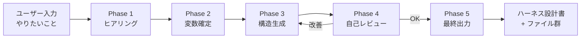
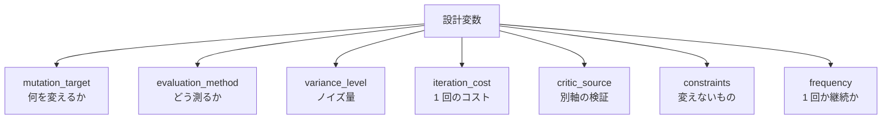

---
tags:
  - forge
  - harness
  - claude-code
---

# forge — ハーネス設計フレームワーク

Tools
#forge
#harness
#claude-code
updated 2026-04-13
3 min read

ユーザーの「やりたいこと」を受け取り、ヒアリング → 設計 → 自己レビュー → 改善を自動で回して、そのタスクに最適なエージェントハーネス（システムプロンプト、スクリプト、設定一式）を出力するフレームワーク。Dinekt の forge コマンドとして実装している。

### 5 フェーズパイプライン

### フェーズ別の役割

| Phase | 役割 | 出力 |
|-------|------|------|
| 1. ヒアリング | 目的・成果物・品質基準・制約を抽出 | 回答セット |
| 2. 設計変数の確定 | 7 変数（変えるもの、評価方法、制約等）を確定 | 変数表 |
| 3. ハーネス構造の生成 | 設計原則に基づき設計書を生成 | 設計書 Markdown |
| 4. 自己レビューと改善 | 原則準拠・アンチパターン該当を検査 | 改善版設計書 |
| 5. 最終出力 | 設計書と必要ファイル群を生成 | ファイル群 |

### 7 つの設計変数

### 内蔵している設計原則

フレームワークは実験から抽出した原則とアンチパターンを内蔵する。筆者的なものを挙げる。

- ワークフローの最初のステップは必ず人間による方向設定で始める
- 自動ループは最大 3 世代まで。それ以上は人間介入を挟む
- レビュアーの評価軸をメインの評価軸と明示的に分離する
- 指示・ルールは最小限にする（「足りなかったら足す」の原則）
- 明確な停止条件を事前定義する
- 人間の判断ポイントを最低 1 つ入れる
- Before/After の定量比較を必ず組み込む

### 得られる価値

- ハーネス設計の再現性が上がる（同じ入力からほぼ同じ設計が出る）
- 設計判断の根拠が原則に紐付けて残る
- Drift Detection の土台になる

## 関連エントリ

- [ADR 参照コマンドによる意思決定の継承](adr-参照コマンドによる意思決定の継承.md)
- [Claude Code settings.json を使いこなす](claude-code-settingsjson-を使いこなす.md)
- [Claude Code のサブエージェント活用法](claude-code-のサブエージェント活用法.md)

  <a class="next" href="../adr-参照コマンドによる意思決定の継承/">ADR 参照コマンドによる意思決定の継承→</a>

