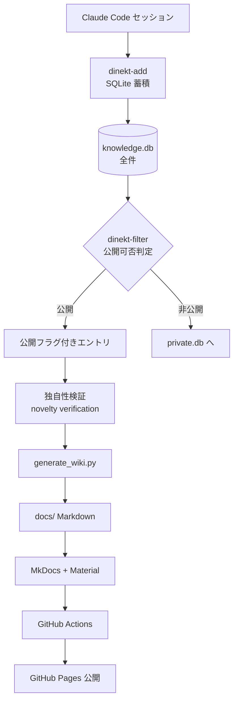
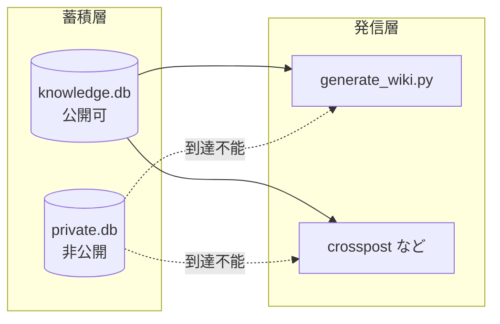

---
tags:
  - wiki
  - sqlite
  - mkdocs
---

# ナレッジベースを静的 Wiki として自動公開するパイプライン

Tools
#wiki
#sqlite
#mkdocs
updated 2026-04-13
3 min read

SQLite に蓄積したナレッジを、静的 Wiki として自動公開するパイプライン。この Dinekt Knowledge Wiki そのものが実装例。

### 全体像

### 設計上のポイント

**1. 二層防御で非公開データを保護**

公開用 DB（`knowledge.db`）と非公開 DB（`private.db`）を物理的に分離する。発信経路のスクリプトは公開 DB しか参照できない権限設計にする。

**2. フィルタと検証を分離する**

- **フィルタ**（カテゴリルール + 簡易コンテンツ解析）: 公開/非公開の自動判定
- **検証**（novelty verification）: 概念の独自性を外部ソースと照合して判定

どちらも `dinekt-add` に組み込んでパイプラインで走らせ、最終的な公開判断は人間が握る。

**3. 表記置換は出力時のみ**

社内用の呼称（例: 「筆者」）を公開時に一般的な呼称（例: 「筆者」）に置き換える。DB 本体は変えず、`generate_wiki.py` が出力時にだけ置換を適用する。

**4. 静的ページの保護**

自動生成しない静的ページ（用語集など）は stale-cleanup の対象外にする。予期しない削除を防ぐため、保護対象のファイル名を明示リストで管理する。

### CLI コマンド群

| コマンド | 役割 |
|---------|------|
| `dinekt-add` | エントリ追加 + 自動フィルタ |
| `dinekt-query` | 全文検索（FTS5） |
| `dinekt-filter` | 公開可否を一括判定 |
| `dinekt-verify` | 独自性検証結果を保存 |
| `dinekt-update` | 公開フラグ・内容・カテゴリ更新 |
| `generate_wiki.py` | Markdown 出力 |

### 得られる効果

- ナレッジ蓄積と公開が同じパイプラインに乗るので、継続性が保たれる
- 非公開データの漏洩リスクを構造的に減らせる
- 外部読者に公開する価値があるものだけが残る

## 関連エントリ

- [SQLite FTS5 で日本語を全文検索する](../tech-notes/sqlite-fts5-で日本語を全文検索する.md)
- [SQLite FTS5 クエリは phrase 化して安全に渡す](../tech-notes/sqlite-fts5-クエリは-phrase-化して安全に渡す.md)
- [ADR 参照コマンドによる意思決定の継承](adr-参照コマンドによる意思決定の継承.md)

  
← [評価ハーネスの設計 — プロンプトを育てる仕組み](評価ハーネスの設計-プロンプトを育てる仕組み.md)

  

