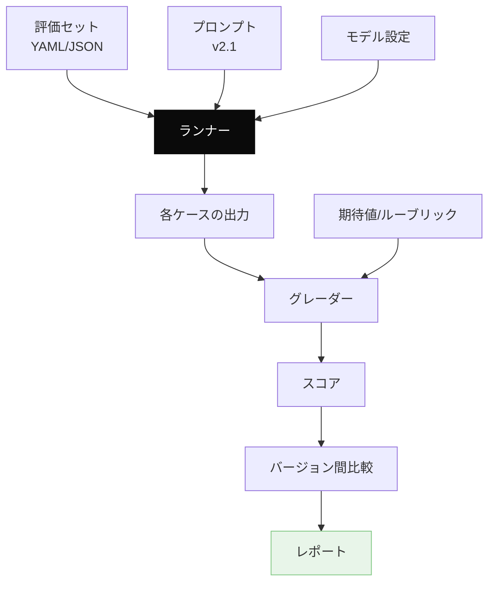
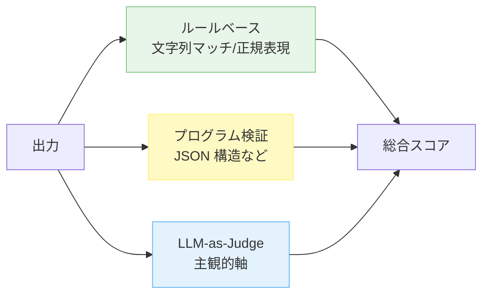
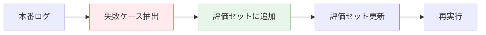

---
tags:
  - eval
  - harness
  - tools
  - cicd
---

# 評価ハーネスの設計 — プロンプトを育てる仕組み

Tools
#eval
#harness
#tools
#cicd
updated 2026-04-13
5 min read

LLM 機能の評価セットを**継続運用**するには、専用のハーネス（実行基盤）が要る。評価セットの作成・実行・スコアリング・比較を 1 つの仕組みに集約する。

### 評価ハーネスの全体像

### 最低限の構成要素

**1. 評価セット（データ）**

YAML/JSON で、各ケースに以下を書く:

    - id: case-001
      category: success
      input: "ユーザーがログインできない原因を調べて"
      expected_behavior:
        - ツール search_logs を呼ぶ
        - 結果に基づき根本原因を 1 つ特定する
      grading:
        rubric_id: troubleshooting-v1

**2. ランナー**

評価セットを読み、プロンプトとモデル設定を使って LLM を呼び出し、結果を収集する。

- 並列実行（ケース数 × モデル数の組み合わせ）
- 失敗時のリトライ
- ログ記録（入力・出力・メタ情報）

**3. グレーダー**

各ケースの出力を採点する。3 種類の方式を組み合わせる。

**4. レポート**

- 合格率・失敗率
- カテゴリ別の内訳
- 前バージョンとの diff（改善・回帰）
- 具体的な失敗ケース（再現用）

### 評価ハーネスに求められる要件

- **再現性**: 同じ評価セット・同じプロンプトなら、何度実行しても同じ結果が出る（モデルの非決定性の範囲で）
- **速度**: 100 ケースを数分で回せる（並列化）
- **低コスト**: 開発中に何度も回せる料金感
- **可観測性**: どのケースが落ちたか、なぜ落ちたかが分かる
- **履歴**: 過去のスコアを保存して傾向を見られる

### よくあるつまずき

**1. ランナーを自前で作って止まる**

並列化・リトライ・ログ・レポートを全部自前で作ると、評価ハーネスの実装に時間が溶ける。既存ツールで足りるなら使う。

**候補ツール**:

- `promptfoo`（CLI 型・YAML 定義）
- `deepeval`（pytest 互換）
- `langsmith`（LangChain 統合）
- `autoevals`（プログラマブル）

**2. グレーダーを LLM だけに頼る**

主観的な軸でも、なるべくルールベースで採点可能な部分は分解する。コストと再現性が改善する。

**3. 評価セットが静的になる**

運用開始後に見つかった失敗を評価セットに追加しないと、同じ失敗を繰り返す。**本番ログから評価セットへのフィードバックループ**を作る。

### 運用リズムの例

- **PR 提出時**: 影響範囲のみ評価（速度優先）
- **マージ時**: フルセット評価
- **週次**: 評価セット棚卸し（古いケース削除、新ケース追加）
- **月次**: 評価ハーネス自体のレビュー

### チェックリスト

- [ ] 評価セットが YAML/JSON でバージョン管理されている
- [ ] ランナーが並列実行できる
- [ ] グレーダーが 3 方式（ルール・プログラム・LLM）を組み合わせている
- [ ] 前バージョンとの比較レポートが出る
- [ ] 本番失敗 → 評価セット追加のフィードバックがある
- [ ] 開発中に気軽に回せる速度・コスト

### まとめ

評価ハーネスは**プロンプトを育てる仕組み**。これがないと、改善が感覚に頼ることになる。既存ツール（promptfoo 等）で足りるならそれを使い、足りなければ最小限の自前実装を組む。

## 関連エントリ

- [forge — ハーネス設計フレームワーク](forge-ハーネス設計フレームワーク.md)
- [Eval-Driven Development — LLM 機能開発は評価から始める](../concepts/eval-driven-development-llm-機能開発は評価から始める.md)
- [LLM-as-Judge — 評価者 LLM の組み立て方](../techniques/llm-as-judge-評価者-llm-の組み立て方.md)

  
← [Claude Code のサブエージェント活用法](claude-code-のサブエージェント活用法.md)

  
[ナレッジベースを静的 Wiki として自動公開するパイプライン](ナレッジベースを静的-wiki-として自動公開するパイプライン.md) →

